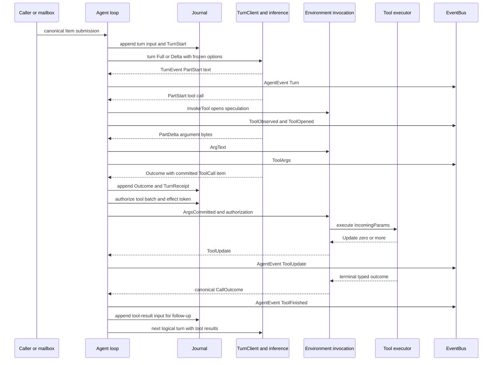
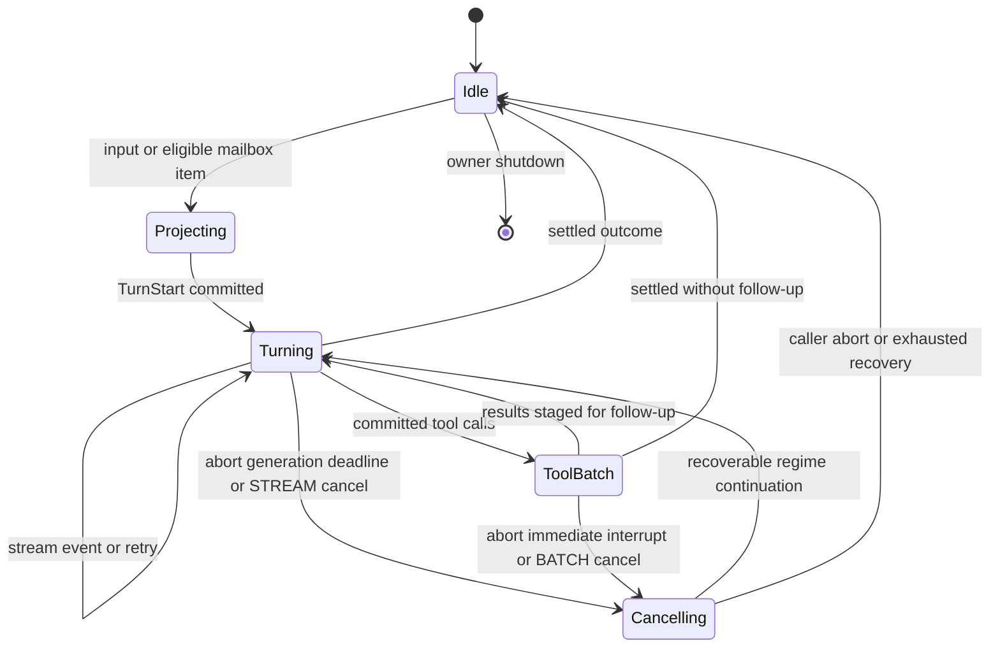
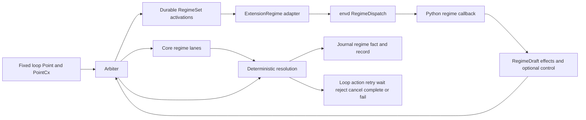
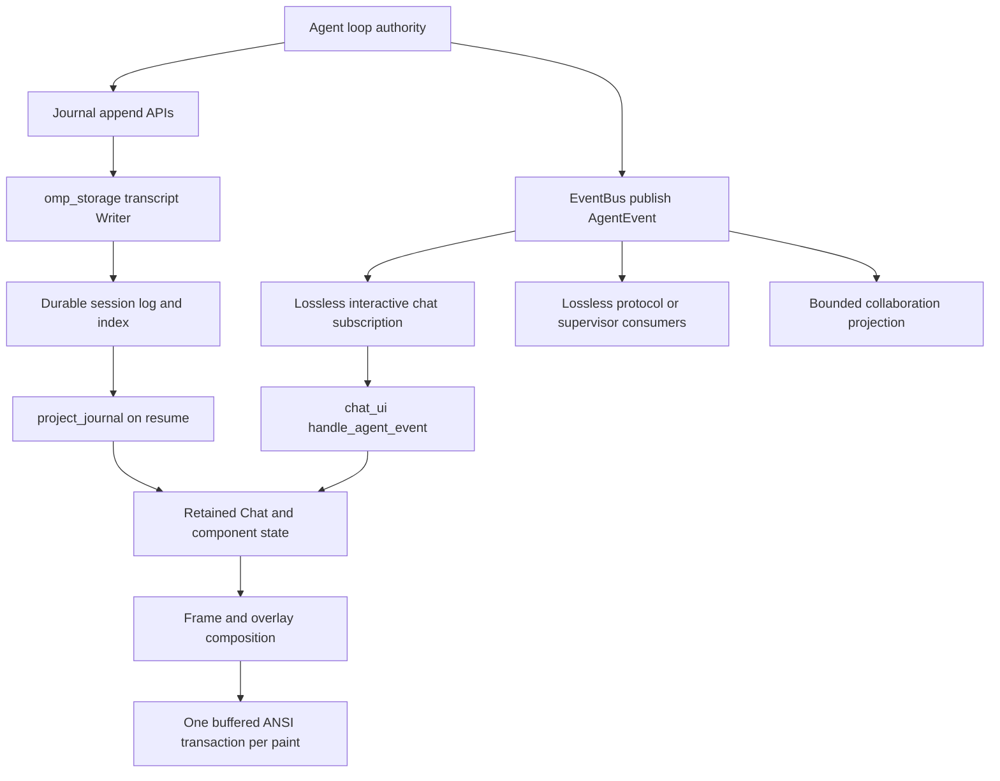

# Agent loop

The agent loop is the durable owner of a caller submission from canonical input through inference, speculative tool execution, journal commitment, and presentation events. `Agent<C: TurnClient>` in `crates/agent/src/loop.rs` composes transport, environment access, immutable turn state, the append-only journal, the event bus, the interrupt mailbox, tool and hook channels, jobs, control-plane regimes, and recovery state. Driver code assembles those dependencies; the loop itself stays transport-neutral. Process placement and protobuf transport boundaries are described separately in [`processes.md`](processes.md).

## Composition and state ownership

`Agent::new` takes a `TurnClient`, `omp_env::EnvClient`, `AgentState`, `Journal`, and `CapsBase` (`crates/agent/src/loop.rs`). It creates:

- one `Mailbox` for asynchronous canonical thread inputs;
- one `EventBus` for host observations;
- a `JobBoard` whose settlements feed that mailbox and event bus;
- an out-of-band `tokio::watch<u64>` abort generation;
- an `InvocationHookBus` for per-invocation hook queries;
- a `ControlMailbox` for journal, projection, rewind, and regime control;
- an `Arbiter` that owns regimes and fixed-point decisions.

`AgentState` publishes `Arc<AgentSnapshot>` through `tokio::watch` (`crates/agent/src/state.rs`). A fresh snapshot is sampled before each logical turn. It freezes `TurnOptions`, enabled tools, the live registry, prompt properties/source, interrupt and steering policy, deadline, retry policy, compaction policy, context promotion, and unexpected-stop behavior for that turn. Concurrent configuration updates clone and atomically replace the snapshot; they do not mutate a turn already in flight.

The driver supplies application policy rather than adding it to the loop. `session_blueprint` and `agent_snapshot` project model catalog, workspace, prompt, and tool registry state into an initial `AgentSnapshot` (`crates/driver/src/chat.rs`). `ChatParentHost` retains the environment, broker, child supervisor, extension hook gate, and live `AgentLoopControls` (`AgentHostControl`, `ControlSender`, `AbortHandle`, and `EventBus`) for each session in the same file.

## Durable turn flow

### 1. Input and staging

`Agent::submit` wraps a complete caller submission; `submit_inner` performs the N-turn loop (`crates/agent/src/loop.rs`). Caller items are canonical `omp_proto::thread::v1::Item` values. Before starting inference, the loop:

1. samples the abort generation and restores pending jobs;
2. drains eligible mailbox inputs;
3. runs the `before_agent_start` hook gate when subscribed;
4. appends caller and interrupt items with `Journal::append_turn_input`;
5. publishes current live history and emits the `agent_start` observation.

The journal is the authority. `Journal` owns an `omp_storage::transcript::Writer`, cached reader/live projection, turn starts and receipts, pending inputs, invocation transitions, tool-batch authorizations, regime facts, jobs, and session-index integration (`crates/agent/src/journal.rs`). `Journal::create` creates transcript v4 lazily; `Journal::open` rebuilds all live indexes from durable events.

### 2. Projection and prompt

`run_turn` samples one `AgentSnapshot`, verifies that a resumed turn's toolset hash still resolves, renders the prompt, and decides whether to reseed or send a context delta (`crates/agent/src/loop.rs`). Full reconstruction uses `project_journal`, `project_context`, and optional `ContextProjectionHandler` hooks; toolset or prompt changes force a safe projection boundary. `Journal::start_turn` durably records the exact input, prompt hash and events, toolset hash, enabled tools, sequence targets, and frozen `TurnOptions` before the loop enters `AgentPhase::Turning`.

### 3. Inference stream

`TurnClient` and `TurnSession` are the transport seam (`crates/agent/src/turn.rs`). `TurnClient::turn` opens one logical turn from either `TurnInput::Full(Thread)` or `TurnInput::Delta(ContextRef, ThreadDelta)`. `TurnSession::events` yields canonical protobuf `TurnEvent` values; `TurnSession::submit` sends responses to server-initiated invocations. Dropping a session structurally cancels both sides.

Inside inference, provider codecs normalize vendor frames to `ChatEvent` (`crates/inference/src/event.rs`). Its important variants are block starts, text/thinking deltas, tool-call start and argument deltas, the sole executable `ToolCallReady`, usage, workflow control, and completion. `AnswerLayer` and the remaining Tower layers preserve this canonical stream (`crates/inference/src/layer/answer.rs`, `crates/inference/src/lib.rs`). `InferenceRpc::turn_events` converts `ChatEvent` into protocol `TurnEvent::{Accepted, PartStart, PartDelta, PartEnd, Invoke, Outcome, Error}` and constructs the terminal canonical output (`crates/serve/src/inference.rs`). The agent therefore does not consume provider-specific events.

`drive_session` publishes every visible protocol event as `AgentEvent::Turn` before interpreting it (`crates/agent/src/loop.rs`). It also services host control and duplex provider invocations while the stream is live. Text and thinking parts become presentation deltas. A tool `PartStart` resolves the exact live `ToolIdentity`, checks it against the frozen enabled-tool list, resolves the ADMISSION regime point, opens a speculative environment invocation, and records `InvocationPhase::Open`. Each tool `PartDelta` is relayed as raw argument text and is also offered to STREAM regimes.

### 4. Speculation, commit, and tool batches

The implementation's concrete argument-feed types are `InvocationFeed` and `IncomingParams`, with wire frames `ArgText` and `ArgsCommitted` (`crates/tool/src/incoming.rs`, `crates/proto/proto/omp/env/v1/env.proto`). The architecture shorthand “ArgFeed” refers to this single linear feed; there is no Rust type named `ArgFeed`.

`SpeculativeCall::open_with_props` sends `InvokeTool`, publishes `ToolObserved` then `ToolOpened`, and starts an invocation pump (`crates/agent/src/batch.rs`). `SpeculativeCall::relay_fragment` forwards each raw fragment to subscribed hooks and the environment while retaining the exact concatenation. This permits preview and argument pulls, but effects remain unauthorized. Dropping or abandoning an uncommitted call cancels it structurally.

When inference commits its authoritative output, `committed_calls` reconciles streamed fragments with canonical restored arguments. `SpeculativeCall::commit` is a local transition: it creates an unforgeable effect token and authorization timestamp but sends no authorization I/O. Before any effect begins, the loop:

1. appends the complete inference `Outcome` and `TurnReceipt` with `Journal::append_arbiter_outcome`;
2. records committed invocation facts;
3. commits `Journal::authorize_tool_batch` with the model-issued call ids;
4. records `InvocationPhase::EffectsAuthorized` plus token, time, and narrowed effects for every call;
5. resolves the BATCH regime point;
6. transitions to `AgentPhase::ToolBatch` and drives the batch.

`ToolBatch::drive_interruptible` authorizes calls concurrently unless a declaration requires issued-order execution; results are returned in original model order (`crates/agent/src/batch.rs`). One call's admission or approval does not reorder the batch. Tool implementations consume `IncomingParams` and emit `Ev<Update, Payload, Fault>` (`crates/tool/src/lib.rs`). Terminal truth is lowered to the four-arm `CallOutcome::{Ok, Faulted, ArgsRejected, Aborted}`; large structured detail may become `CallOutcomeDetails::Spilled`. Every settled result produces a canonical thread item and `AgentEvent::ToolFinished`, which the next logical turn submits as tool-result context.

### 5. Settlement and continuation

After a batch, the loop stages canonical results, registers detached jobs, drains mailbox items at defined points, resolves TURN_END and SETTLE regimes, and either opens a follow-up turn or settles the submission (`crates/agent/src/loop.rs`). Empty-output recovery, context conflicts, context overflow, model promotion, compaction, and bounded retry are loop-owned rather than `TurnClient` behavior; the loop records turn starts, outcomes, aborts, receipts, and regime facts through `Journal` as those paths settle. `AgentRunSummary` classifies the final outcome as completed, warning, yield, caller abort, or failure through `RunSettlement` in the same file.

## Interrupt and cancellation model

There are two independent channels because they have different semantics.

### Ordered input mailbox

`Mailbox` is a single-consumer, unbounded flume channel plus a receiver-owned `VecDeque` backlog (`crates/agent/src/mailbox.rs`). `MailboxSender::try_enqueue` never blocks a producer. An `Interrupt` contains a canonical item, typed `InterruptSource`, and earliest eligible `InterruptClass`:

- `Immediate`: between tool completions during a batch;
- `TurnBoundary`: after a committed outcome;
- `Idle`: when the loop would otherwise stop.

`Mailbox::drain_steering` preserves FIFO order within each class and drains classes in precedence order. `defer_interrupts` permanently demotes immediate entries to the turn boundary. Steering limits apply only to user/peer steering; durable job settlements and continuations are not throttled. `requeue_front` rolls a drain back if surrounding work aborts before staging.

Mailbox cancellation safety is explicit: `Mailbox::wait` retains the received item in its local backlog, and the loop races that future against other sources. Selecting another branch cannot consume and lose the interrupt.

### Priority abort signal

`AbortHandle` increments a `tokio::watch<u64>` generation (`crates/agent/src/loop.rs`). The loop snapshots that generation at submission start and uses `watch::Receiver::changed` in `tokio::select!` while opening inference, streaming, and driving tools. Because watch retains the newest value rather than queueing events, abort is a level/generation signal rather than another ordered transcript item.

During a tool batch, the loop creates `watch<Option<Str>>` and passes its receiver to `ToolBatch::drive_interruptible`. User abort, turn deadline, immediate mailbox steering, or a BATCH regime cancellation replaces the reason. Each call receives an independent interruption request; cooperative settlement gets `INTERRUPT_GRACE` (500 ms in `crates/agent/src/loop.rs`) before resource-owned forced cancellation. Once a call has been effect-authorized, uncertainty is represented durably as `Abort::EffectsUnknown`, not hidden as a generic error (`crates/tool/src/lib.rs`).

The diagram's `Cancelling` state is explanatory, not an `AgentPhase` enum variant. The observable code states are exactly `Idle`, `Projecting`, `Turning`, and `ToolBatch` in `crates/agent/src/events.rs`; cancellation is a transition path represented by watch state, abort records, and typed outcomes.

## Hooks and regimes in the control plane

### One-shot hooks

`HookGate` owns the subscription bitmap and per-invocation decision procedure (`crates/agent/src/hooks.rs`). An unsubscribed event performs one relaxed atomic bit test and constructs no payload. For local composition, `gate` runs PRECHECK, TRANSFORM, REVIEW, and APPROVAL in order, validating that each `GateDecision` arm is legal for its phase and retaining a `TransformTrail`. The live extension path uses `HookGate::delegated_channel`: envd's `HookControlFactory` receives one complete dispatch, selects only sealed subscriptions, sorts them by phase/order/name/extension, calls the exact extension generation, composes changes, and answers with one final `GateDecision` (`crates/envd/src/tools.rs`). See [`extensions.md`](extensions.md) for extension loading and the CONTROL callback path.

Tool admission is per invocation. `InvocationHookBus` forwards `ArgText` observations and `AdmitInvocation` queries from each invocation pump (`crates/agent/src/batch.rs`). Core can allow, deny with structured `PolicyDenied`, modify the effective target/arguments, or collect approval requirements; the environment owns the effect gate and will not accept `ArgsCommitted` as authorization until the query is answered.

Hooks also attach at submission, prompt, stream, item-commit, tool-result, agent-settled, provider-error, lifecycle, and notification seams through `notify_json`/`gate_json` calls in `crates/agent/src/loop.rs` and envd. These are not per-token plugin callbacks: message updates are coalesced by `MessageHookStream` with a 16 ms window.

### Durable regimes and the arbiter

`Arbiter` folds durable `RegimeSet` activations with always-on core lanes at a closed set of `Point` values (`crates/agent/src/arbiter.rs`). `run_turn` resolves CONTEXT, TOOL_CHOICE, PRE_MODEL, STREAM, ADMISSION, BATCH, TURN_END, SETTLE, and IDLE at their actual loop boundaries. `PointCx` provides immutable event facts; each regime writes an isolated `RegimeDraft`. Resolution facts and lifecycle records are flushed through `Journal::append_regime_fact` and `append_regime_record` (`crates/agent/src/journal.rs`).

Extension regimes cross the envd control plane as `RegimeStart`, `RegimeApply`, `RegimeStop`, and `RegimeDraft` frames. `ExtensionRegimeResolver` constructs an `omp_agent::Regime` only from exact-generation sealed registry evidence (`crates/envd/src/worker.rs`), and `AgentRegimeControlBackend` delegates mutations to the sole live loop (`crates/driver/src/chat.rs`). This keeps extension code outside the mutable agent owner while allowing durable middleware at fixed points.

The repository's owner guidance still uses “campaign arbiter” and `omp.Decision` as architectural shorthand (`AGENTS.md`), but those are not current public/runtime symbols. The current Python contract explicitly has no public decision object: regime handlers stage effects through `ctx` and choose at most one control through `next_` (`docs/py/15-regimes.md`). The frozen-surface test asserts that `omp.campaign` and `omp.CampaignScope` do not exist (`crates/py/tests/frozen_surface.rs`). The implemented Rust vocabulary is `Arbiter`, `Regime`, `RegimeContext`, `Next`, and internal `RegimeDraft` (`crates/agent/src/arbiter.rs`, `crates/agent/src/regime.rs`).

## Events, storage, and presentation

`EventBus` provides ordered, nonblocking fan-out of immutable `Arc<AgentEvent>` values (`crates/agent/src/events.rs`). One mutex establishes the same publication order for all subscribers. It supports:

- unbounded, lossless subscriptions for consumers that cannot drop observations;
- bounded, lossy UI subscriptions with exact dropped-event accounting;
- bounded collaboration subscriptions restricted to an allowlisted projection.

The interactive chat adapter deliberately uses a lossless subscription through `subscribe_chat_events` (`crates/app/src/chat_ui.rs`). `handle_agent_event` maps `AgentEvent::Turn` part events to assistant begin/delta/end operations, speculative tool events to live argument views, `ToolUpdate` to folded progress, and `ToolFinished` to a terminal tool card. Its `BridgeState` retains active part ids, markdown buffers, streaming tool argument bytes, `ToolDisplay` state, jobs, usage, and extension renderer routes.

Durability is not delegated to a UI subscriber. The loop commits `TurnStart`, terminal inference outcomes, tool-batch authorization, invocation transitions, regime facts, and follow-up items directly through its sole mutable `Journal` before or at their authority boundary (`crates/agent/src/loop.rs`, `crates/agent/src/journal.rs`). It then publishes immutable presentation events. On resume, `project_journal` rebuilds canonical items from `omp_storage::transcript`; the UI can replay those items without treating ephemeral `ToolUpdate` events as history.

`crates/tui` is a retained component system: `Component` and `Cached` retain identity, geometry, properties, and transition state (`crates/tui/src/component.rs`). The chat UI sends semantic `BackendEvent` updates into the retained `Chat` surface rather than printing deltas. Components paint cells into `Frame` values; overlays are resolved as layers. `Renderer::present`, `repaint`, `retire`, and `replay` build the complete synchronized terminal update in a string and call the renderer's writer once per transaction on native terminals (`crates/tui/src/renderer.rs`). Windows/ConPTY may split that already-materialized byte string at safe escape boundaries, but components never independently emit ANSI.

This produces one final ANSI materialization boundary: streamed inference and tool events update retained state many times, while each paint compares/composites frames and serializes only the resulting terminal transaction. `Renderer::present` is history-neutral; finalized rows enter terminal history only through explicit `retire`, and full logical history is rebuilt through `replay` (`crates/tui/src/renderer.rs`).

## Failure and recovery invariants

- A `TurnStart` is durable before an inference attempt is driven; `append_arbiter_outcome` is idempotent only for a field-exact replay (`crates/agent/src/journal.rs`).
- A tool batch is durably authorized only after its terminal inference receipt exists and every call id appears in that receipt (`Journal::authorize_tool_batch`).
- A speculative call that never commits is cancellation-safe and cannot be invented as a settled result (`SpeculativeCall` in `crates/agent/src/batch.rs`).
- Every committed tool call returns a canonical result, including environment failures after authorization; uncertainty is data in `CallOutcome`, not a missing event.
- Provider context conflicts and retryable errors are loop-owned recovery paths. `TurnClient` implementations transport turns but do not retry, rebase, reseed, journal, or deduplicate (`crates/agent/src/turn.rs`).
- Presentation loss cannot corrupt storage. Durable state is journaled directly; lossy subscribers account drops, and the interactive adapter currently chooses the lossless event subscription (`crates/agent/src/events.rs`, `crates/app/src/chat_ui.rs`).

## Key files

| Component | Path |
|---|---|
| Durable N-turn loop | `crates/agent/src/loop.rs` |
| Ordered interrupt mailbox | `crates/agent/src/mailbox.rs` |
| Immutable turn configuration | `crates/agent/src/state.rs` |
| Agent event bus | `crates/agent/src/events.rs` |
| Append-only journal owner | `crates/agent/src/journal.rs` |
| Turn transport seam | `crates/agent/src/turn.rs` |
| Speculative calls and tool batches | `crates/agent/src/batch.rs` |
| Hook subscription and decision procedure | `crates/agent/src/hooks.rs` |
| Regime arbiter | `crates/agent/src/arbiter.rs` |
| Regime state and draft semantics | `crates/agent/src/regime.rs` |
| Canonical inference events | `crates/inference/src/event.rs` |
| Tower inference surface | `crates/inference/src/lib.rs` |
| ChatEvent to TurnEvent service projection | `crates/serve/src/inference.rs` |
| Tool argument feed | `crates/tool/src/incoming.rs` |
| Typed tool outcomes | `crates/tool/src/lib.rs` |
| Driver chat composition | `crates/driver/src/chat.rs` |
| Interactive event adapter | `crates/app/src/chat_ui.rs` |
| Retained component model | `crates/tui/src/component.rs` |
| Final terminal renderer | `crates/tui/src/renderer.rs` |
| Python regime contract | `docs/py/15-regimes.md` |
