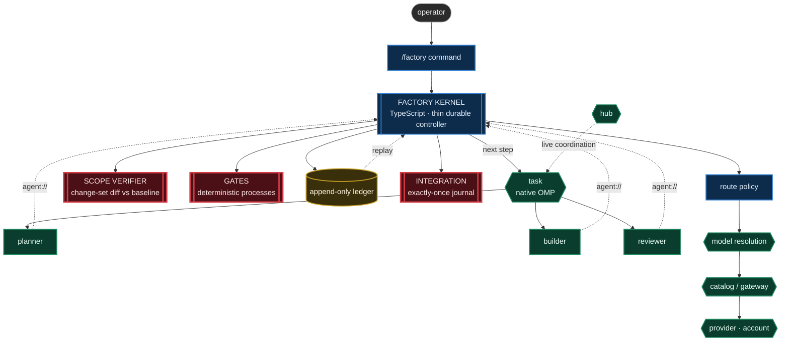
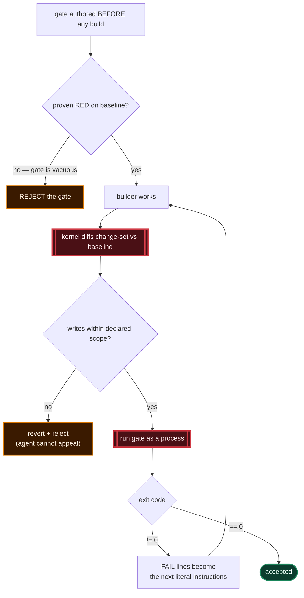
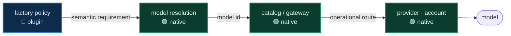
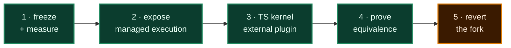

# Greenfield Architecture Audit — OMP-native Software Factory

> **Status:** research artifact, corrected after Swarm archaeology. Not a design doc, not a commitment.
> **Method:** repository/source audits across OMP, historical Swarm, SSSF and Fusion Harness, plus disposable behavioral probes.
> **Correction:** the original current-tree search missed the deleted first-party Swarm package. See [`swarm-factory-integration-audit.md`](./swarm-factory-integration-audit.md) for the evidence and dependency decision.

---

## Legend

| Marker | Level | Meaning |
|:---:|---|---|
| 🟢 | **L0** | Native OMP. Configuration only, zero code. |
| 🔵 | **L1** | External plugin. No core modification. |
| 🟠 | **L2** | Small *generic* upstream extension point. Benefits more than this product. |
| 🔴 | **L3** | Factory-specific core modification. To be avoided. |

| Marker | Verdict |
|:---:|---|
| ✅ | Exists and suffices |
| ⚠️ | Exists but partial |
| ❌ | Does not exist — absence proven by search |

---

## 1. Five findings that redefine the problem

### 🟠 1. Swarm existed, but is not a current dependency

First-party `packages/swarm-extension` implemented YAML DAGs and shipped in-tree through OMP 17.2.8. Commit `b0a94a8fc0` deleted it before 17.2.9. npm stopped at 13.17.0 with a `pi-coding-agent: ^13` peer while current OMP is 18.1.15. Its useful DAG vocabulary survives; its package and runtime do not.

### 🟠 2. DAG execution exists in history and the ADW prototype

Historical Swarm provided deterministic execution waves. The current ADW prototype provides a stronger readiness graph with success-gated dependencies, versioned inputs, isolation and replay. Core `task` remains an execution primitive rather than a durable workflow scheduler.
### 🟢 3. `task` children are already clean-room

They inherit **no** parent conversation history — only a rendered assignment plus an optional shared `context` string. Fusion Harness had to spawn `pi --mode json -p --no-skills --no-extensions --no-context-files` subprocesses to obtain what OMP provides natively, in-process.

Evidence: `packages/coding-agent/src/task/structured-subagent.ts`, `packages/coding-agent/src/task/executor.ts`.

### 🟢 4. Agent types are markdown discovered from plugin roots

Discovery order: `.omp/agents/` → `~/.omp/agent/agents/` → every OMP extension root's `agents/` → Claude marketplace plugin `agents/` → bundled.

A plugin registers new roles **with zero core changes**.

Evidence: `packages/coding-agent/src/task/discovery.ts`, `packages/coding-agent/src/discovery/helpers.ts`.

### 🔴 5. Prompt-only authority is not authority

This is the finding that justifies a deterministic component, and it is **empirical, not theoretical**.

In Fusion Harness's own shipped demo run, the validator diagnosed a defect in its own gate — twice — and both times assigned the fix to a human instead of using the write tool it was holding. The run ended RED on a correct build.

Evidence: `live_final_generation/harness-artifacts/triage-round-3.md`, `triage-round-4.md`, `MANIFEST`.

SSSF reaches the same conclusion by another route: its `permissions.py` diffs git change-sets precisely because a tool allowlist is structurally incapable of catching a `git checkout` that reverts someone else's work.

> **Findings 3 and 4 make the answer small. Finding 5 makes it necessary.**

---

## 2. Capability matrix

| Capability | Native | Existing plugin | Composition | New plugin | Core mod |
|---|:---:|:---:|:---:|:---:|:---:|
| Delegated agents | 🟢 ✅ `task` | — | — | — | — |
| Multi-agent parallelism | 🟢 ✅ `task.maxConcurrency` semaphore | — | — | — | — |
| Topologies (panel, fusion, judge) | — | — | 🟢 ✅ `task` + `outputSchema` + `agent://` | — | — |
| DAG orchestration | — | ⚠️ historical Swarm was removed | — | 🔵 ✅ | — |
| Typed envelopes | 🟢 ✅ `outputSchema` + `schemaMode:strict` | — | — | — | — |
| Versioned handoff | — | ⚠️ `agent://<id>?q=` is addressable, not workflow-versioned | — | 🔵 index | — |
| Deterministic verification | ❌ | — | ⚠️ hooks block, do not verify | 🔵 ✅ | — |
| Correction loops | — | — | 🟢 ✅ `runSubagentFollowUpTurn` | 🔵 policy | — |
| Write isolation | 🟢 ✅ optional task worktrees | — | ⚠️ no declared workflow write scope | 🔵 ✅ | — |
| Context optimization | 🟢 ✅ deep stack | — | — | — | 🟠 optional |
| Model routing | ⚠️ static pattern list | — | — | 🔵 ✅ policy | 🟠 2 gaps |
| Gateway routing | 🟢 ✅ ~68 descriptors | — | — | — | — |
| Benchmark feedback | ⚠️ cost yes, phase attribution no | — | — | 🔵 ✅ | — |
| Workflow crash recovery | ❌ | ❌ Swarm persisted status only | ❌ | 🔵 ✅ | — |
| Trace / audit | ⚠️ session JSONL, `history://` | — | ⚠️ | 🔵 ✅ | — |

**Workflow code remains necessary. One small generic core extension point is a cutover prerequisite.**

---

## 3. Architecture



| Colour | Meaning |
|---|---|
| 🟢 green | Native OMP — already exists, reused as-is |
| 🔵 blue | The new plugin — the only code written |
| 🔴 red | Fail-closed enforcement points |
| 🟡 amber | Durable state |

---

## 4. What gets built

### 🟢 L0 — Native, zero code

| Need | OMP primitive | Why it suffices |
|---|---|---|
| Agent roles | markdown in `<plugin>/agents/*.md` | frontmatter pins model, thinking, tools, `spawns`, output schema — **role ≠ model already solved** |
| Delegated execution | `task` | fresh child, no inherited history |
| Clean-room | default in `task` | Fusion Harness needed subprocesses for this |
| Parallel fan-out | `tasks[]` + semaphore | a panel is a batch |
| Output contract | `outputSchema` + `schemaMode:"strict"` | in-tool validation with 3 retries, then executor post-mortem |
| Handoff | `agent://<id>?q=.field`, artifacts | addressable, nested `Parent/Child` |
| Live coordination | `hub` send/wait/inbox | delivery receipts, wakes parked peers |
| Session continuation | `runSubagentFollowUpTurn` | correction reuses the builder's own session |
| Passive review | Advisor (`WATCHDOG.yml`) | fires each primary turn, outside the peer namespace |
| Budget | Goal | tokens + wall clock, hidden-message steering |
| Context economy | hashline, structural read summary, artifact spill, 5-method compaction, prompt caching, `xd://` | settings-driven |
| Gateway reach | provider descriptors | OmniRoute / CPA / LiteLLM / OpenRouter are catalog entries |

### 🔵 L1 — One new plugin: `omp-factory`

```
omp-factory/
├── agents/*.md          🟢 roles: planner, builder, reviewer, validator
├── kernel/              🔵 deterministic workflow code
│   ├── state.ts             phase DAG + attempt budget + pause/resume
│   ├── ledger.ts            atomic durable log + replay
│   ├── scope.ts             post-hoc change-set verification
│   └── integrate.ts         serialized exactly-once journal
├── gates/               🔵 deterministic verifiers
├── route/               🔵 model selection policy
└── index.ts             🔵 tool + hooks + command registration
```

### 🟠 L2 — Generic upstream additions

One addition is a cutover prerequisite; the others remain optional. All benefit consumers beyond this product.

| Gap | Generic beneficiary |
|---|---|
| Stable managed-subagent execution API carrying current `task` policy | schedulers, IDEs, custom commands, external controllers |
| Route-decision hook returning `{model, effort}` atomically | any cost-aware router |
| Plugin-registrable compaction method (set is currently closed) | any context strategy |
| Per-child context budget policy | any multi-agent controller |
| Artifact lifecycle / GC — `ArtifactManager` never deletes | every long session |

### 🔴 L3 — None

---

## 5. Does a deterministic kernel belong?

**Yes — but it must not duplicate either historical Swarm or current `task`.** Four invariants remain code-owned:

| Invariant | Why deterministic |
|---|---|
| **Write-scope verification** | An allowlist cannot see a `git checkout`; verify the actual change-set |
| **Durable log + replay** | Crash resume cannot depend on a model remembering or a mutable status snapshot |
| **Exactly-once integration** | Applying a patch twice corrupts the tree |
| **Attempt budget** | The loop must be finite by construction |

Current `task` now supplies child lifecycle and isolated worktrees. Historical Swarm supplied only ordering and shared-workspace status. The plugin kernel owns the remaining workflow semantics: readiness, accepted input versions, gates, recovery and integration.

### The kernel should be TypeScript

This remains the decision that can remove the fork, after OMP exposes a stable managed-subagent API.

The current kernel lives in `crates/pi-tasks`, compiled into `pi-natives` — **and that is what forces OMP to be forked**. Its correctness requirements survive, but a workflow state machine has no performance budget justifying Rust. The external controller should call the same managed execution path as `task`, not wrap raw `runSubprocess` as Swarm did.

---

## 6. Deterministic verification — the gate-first loop



Two properties the reference systems lack:

1. **The RED baseline check.** A gate that passes on an empty tree proves nothing. SSSF ships placeholder quality commands that `exit 0` — its own README calls this *"theater"*.
2. **The change-set diff.** This is what Fusion Harness lacks and why its validator could lie. The gate is a process, not an opinion: `exit != 0` is refusal, with no prompt-level appeal.

---

## 7. Routing — four layers, four decisions



OMP today resolves by **static ordered pattern list**. `int` (intelligence) and `tps` exist on `Model` but are consumed **only by the model-browser UI**. There is no cost-, capability- or task-driven selection anywhere.

The only automatic model movement today is *reactive* (retry / rate-limit / quota fallback), *phase-based* (prewalk hand-off at first edit) or *side-call* (vision oneshot).

**OmniRoute and CPA are deployment adapters** — a provider descriptor and a `baseUrl`. Zero architectural presence.

---

## 8. Prototype classification

~15.7k lines: ~3.3k genuine kernel, ~4.1k glue, remainder tests / docs / viewer.

| Piece | Lines | Verdict | Reason |
|---|---:|:---:|---|
| `write_guard.rs` snapshot/settle/rollback | 818 | 🟡 **EXTRACT → TS** | Correct idea, the thing Fusion Harness lacks. Rust unnecessary |
| `trace.rs` append-only log + replay | 522 | 🟡 **GENERALIZE → TS** | v6 at 36 B/record is over-engineered for dozens of phases |
| `orchestrator.rs` state machine + DAG | 1,671 | 🔵 **REIMPLEMENT** | Contract right, size wrong. Fits in ~600 TS lines |
| `gate.rs` + `DiffMatchesClaims` | 172 + N-API | 🟢 **KEEP** conceptually | The best gate in the system |
| `envelope.rs` | 126 | 🔴 **DELETE** | `task`'s `outputSchema` already does this, with retries |
| `tasks.rs` N-API bindings | 1,071 | 🔴 **DELETE** | Exists only to cross a boundary that disappears |
| `runner.ts` seat spawning | ~700 | 🔴 **DELETE** | `task` already does this |
| `runner.ts` workspaces + journal | ~750 | 🟢 **KEEP** | Isolation and exactly-once are real kernel |
| `config.ts` validation | 365 | 🟡 **KEEP, slim** | ~40 refusals; some duplicate engine validation |
| `schema.ts` payload / verdict | 287 | 🟢 **KEEP** | `verdict_consistent` refutes a review against itself |
| `prompt.ts` | ~400 | 🔴 **DELETE** | Prompts are the agent markdown frontmatter |
| `adw-web` viewer | 712 | ⚪ **DEFER** | Useful, not blocking |

> **~15.7k → ~2.5k lines, in a plugin, with no fork.**

---

## 9. Migration



1. 🟢 **Freeze and measure.** Current ADW remains the executable reference; its example workflows become the acceptance suite.
2. 🟠 **Expose managed execution.** Land a small generic upstream API that carries current `task` policy—schemas, isolation, artifacts, cancellation and continuation.
3. 🟢 **Build the external TypeScript kernel.** Reimplement the durable workflow semantics; use current task worktrees; do not vendor Swarm.
4. 🟢 **Prove equivalence.** Run the same workflows through both engines and compare dispatch order, inputs, gates, retries, patches, replay and terminal acceptance.
5. 🟠 **Revert the fork.** Only after equivalence, remove `crates/pi-tasks`, `packages/adw-web`, `src/adw`, and related N-API code.

**Reversibility:** trivial through step 4. The existing ADW remains runnable until the external controller has behavioral proof.

---

## 10. Rejected patterns

| Pattern | Origin | Why rejected |
|---|---|---|
| CLI subprocess children | Fusion Harness | replace with OMP's managed in-process subagents |
| JSON event-stream scraping | Fusion Harness | artifact of the subprocess boundary |
| Shared-cwd writer lease as primary safety | Fusion Harness | prefer isolated worktrees + serialized integration; retain a lease only for cross-process fallback |
| AgentGrid TUI, kill-tree escalation, per-process `/tmp` dirs | Fusion Harness | plumbing, not workflow semantics |
| `agent_pi.py` adapter, `--list-models` scraping | SSSF | shell-out artifact |
| Placeholder quality commands that `exit 0` | SSSF | its own README calls it *"theater"*. A gate that never fails is worse than none |
| Historical Swarm package/runtime | OMP | deleted, stale peer range, and missing recovery/safety contracts |
| `SSSFStrategy` / `FusionHarnessStrategy` | brief §9 | generic combinators, not products |
| Prompt-declared role authority | both | refuted by behavioral evidence |

---

## 11. Conclusion

The prototype solved the right deterministic problems. Its requirement list — DAG, write scopes, gates, correction, recovery and exactly-once integration — **survives the analysis intact.**

Historical Swarm changes the implementation history, not the decision. It proves that a compact declarative DAG layer fits naturally above OMP, and its failed lifecycle proves that the Factory must not depend on an unowned extension coupled to raw executor internals.

Current `task`, `hub`, strict outputs, addressable artifacts and isolated worktrees remove most execution plumbing. They do not remove workflow acceptance or crash recovery. The correct cut is a thin external TypeScript controller over a stable managed-subagent API, with the ADW prototype retained until behavioral parity is proven.

> Reuse Swarm's idea. Do not revive its dependency.
