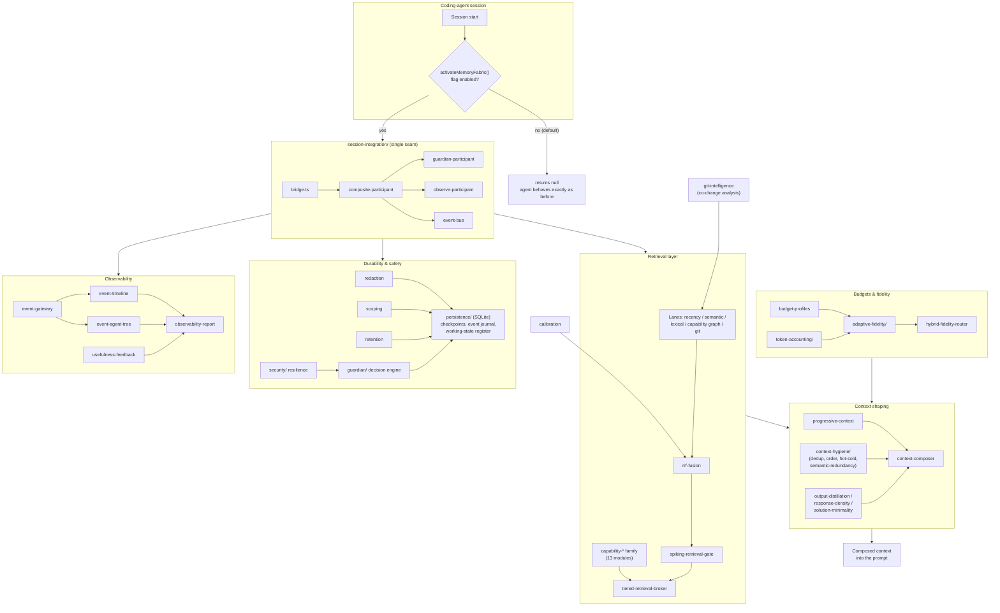
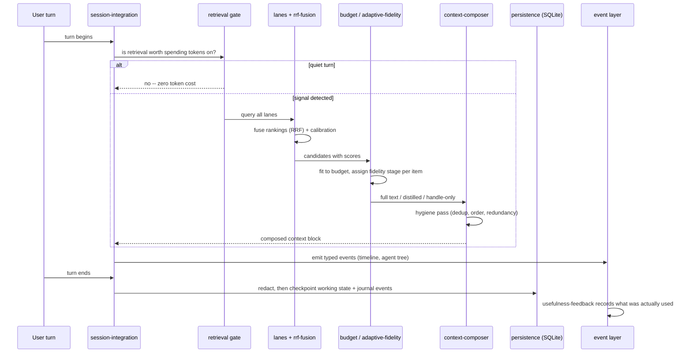
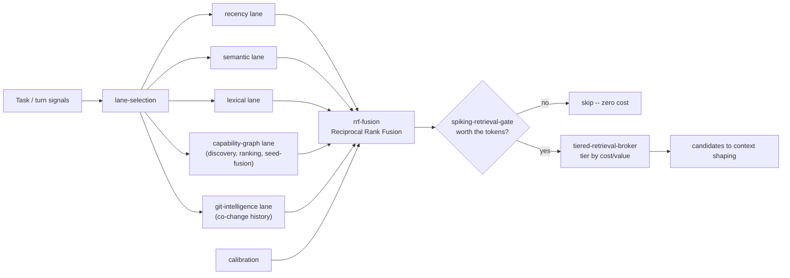
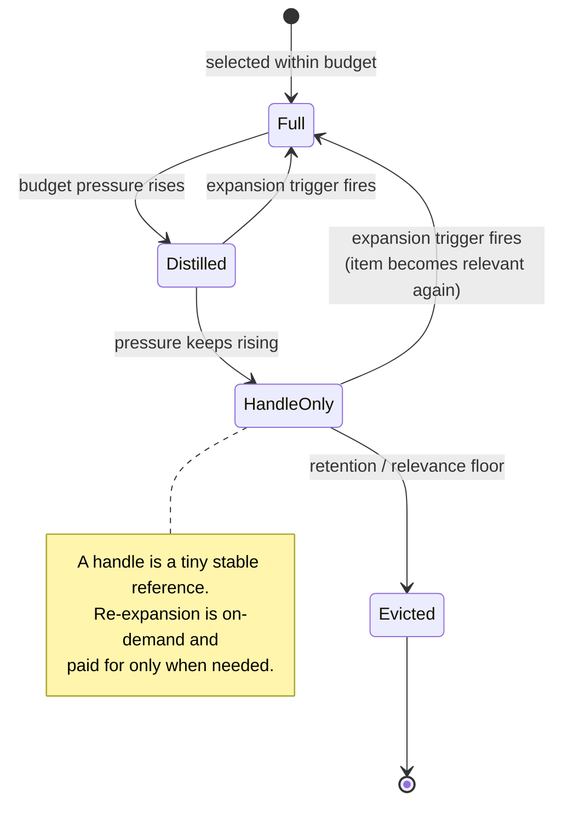

# Memory Fabric

Memory Fabric is an opt-in, flag-gated subsystem that gives the coding agent durable, budget-aware memory: it persists working state across sessions, retrieves only the most relevant prior context under an explicit token budget, and degrades context *gracefully* (progressive fidelity) instead of dropping it abruptly at compaction time.

Everything lives under `packages/coding-agent/src/memory-fabric/` -- **92 source modules** (47 root lanes + 45 files across 8 subsystems) with **68 dedicated test files** under `test/memory-fabric/`. The subsystem is **off by default** and contributes nothing to the default execution path: `activateMemoryFabric` (in `session-integration/activation.ts`) returns `null` unless the feature flag is enabled.

---

## Table of contents

1. [The problem it solves](#the-problem-it-solves)
2. [High-level architecture](#high-level-architecture)
3. [Turn lifecycle](#turn-lifecycle)
4. [Retrieval pipeline](#retrieval-pipeline)
5. [Adaptive fidelity state machine](#adaptive-fidelity-state-machine)
6. [Layer-by-layer walkthrough](#layer-by-layer-walkthrough)
7. [Full module inventory (report card)](#full-module-inventory-report-card)
8. [Test coverage report card](#test-coverage-report-card)
9. [What this gives the omp CLI](#what-this-gives-the-omp-cli)
10. [Design principles](#design-principles)
11. [Engineering provenance & quality audit](#engineering-provenance--quality-audit)
12. [Why this should be merged](#why-this-should-be-merged)
13. [Known follow-ups](#known-follow-ups-maintainers-call)
14. [Enabling it](#enabling-it)

---

## The problem it solves

Today the agent's memory of a session is bounded by the context window plus lossy compaction:

1. **Context loss is abrupt.** When compaction triggers, detail is summarized away wholesale. There is no intermediate state between "full text in context" and "gone".
2. **Nothing durable survives the process.** Objectives, decisions, and hard-won discoveries from one session are invisible to the next unless the user re-explains them.
3. **Context selection is not budget-aware.** There is no mechanism that asks "given N tokens of headroom, which memories/artifacts maximize usefulness for *this* task?"
4. **No feedback loop.** The agent never learns which retrieved context actually helped.

Memory Fabric addresses all four with deterministic, pure, fail-open modules.

---

## High-level architecture

Every arrow into `PROMPT` is metered by the budget layer; every arrow into `persistence/` passes through `redaction` first.

---

## Turn lifecycle

What happens on a single agent turn when the fabric is enabled:

Key property: the **gate runs before any lane query**, so turns that do not need memory pay nothing.

---

## Retrieval pipeline

The `capability-*` family additionally resolves **conflicts** (contradictory memories), detects **cycles** in the capability graph, and exposes a **planner adapter** so retrieval can be steered by the task plan.

---

## Adaptive fidelity state machine

Instead of compaction's one-way cliff, every context item moves through graduated fidelity stages under budget pressure -- and can come back:

Demotion decisions come from `adaptive-fidelity/adaptive-budget.ts` + `expansion-thresholds.ts`; re-expansion from `adaptive-fidelity/expansion-triggers.ts`; routing between fidelity implementations from `hybrid-fidelity-router.ts`.

---

## Layer-by-layer walkthrough

### Retrieval
`rrf-fusion`, `tiered-retrieval-{types,broker}`, `spiking-retrieval-gate`, `lane-selection`, `lane-adapters`, and the `capability-*` family (discovery, graph, ranking, retrieval gate, retriever, seed fusion, conflict resolution, cycle analysis, bundling, fidelity, orchestration, planner adapter, policy). Multiple lanes are fused with Reciprocal Rank Fusion; a gate decides *whether* retrieval is worth spending tokens on at all.

### Context shaping
`progressive-context`, `context-composer`, `contextual-coverage`, `coverage-expansion-builder`, `response-density`, `solution-minimality`, `output-distillation`, `context-hygiene/` (classify, coverage, dedup, hot-cold partitioning, ordering, pipeline, projection, semantic-redundancy). Selected material is composed at graduated fidelity with coverage analysis to detect gaps.

### Budgets & fidelity
`budget-profiles`, `token-breakdown`, `activation-sparsity`, `expansion-thresholds`, `hybrid-fidelity-router`, `capability-fidelity`, `adaptive-fidelity/`, `token-accounting/`. Every byte entering the prompt is accounted against an explicit budget.

### Events
`event-gateway`, `event-timeline`, `event-agent-tree` -- a typed event layer projecting session activity into a timeline and an agent tree, feeding both retrieval and observability.

### Durability & safety
`persistence/` -- SQLite-backed **checkpoint store** (deterministic ordering: `created_at DESC, rowid DESC`, immune to same-millisecond ties), **append-only event journal** (monotonic sequence ordering), **single-row working-state register** (upsert semantics, explicitly documents and refuses the same-ms ordering failure mode), plus `guardian-persistence`. `guardian/` is a defensive decision engine (`decision-engine.ts`, 31.6 KB) with an observe-only mode for safe evaluation. `security/resilience.ts` hardens the fabric against malformed inputs. `redaction` strips secrets before anything is persisted; `scoping` partitions memories; `retention` prunes deterministically.

### Behavioral intelligence
`git-intelligence` (40.4 KB -- co-change analysis: which files historically change together, so the agent anticipates related edits) and `calibration` (28.8 KB -- confidence calibration for retrieval scores).

### Observability & benchmarking
`observability-report` -- pure composition of the timeline / agent-tree / token projections into a single report with text renderers. `git-intelligence-benchmark` -- an honest held-out co-change benchmark: no train/test leakage, exact per-sample means, explicit skip counts.

### Quality & rollout
`quality-auditing`, `usefulness-feedback` (closes the loop: was retrieved context actually used?), `utilization`, `release-manifest`, `rollout/observe.ts` (19.0 KB staged-rollout observation gating).

### Lifecycle integration & composition root
`session-integration/` owns the single runtime entry point (`activateMemoryFabric` in `activation.ts`) plus the bridge, composite/guardian/observe/noop participants, event bus, context injection, and deadline guard. `index.ts` is a deliberately thin barrel (re-exports `types.ts` only); in-package callers import file subpaths directly, matching this repo's alias resolution.

---

## Full module inventory (report card)

### Root lanes (47 files, `src/memory-fabric/`)

| Area | Module | Size (B) |
|---|---|---:|
| Retrieval | `rrf-fusion.ts` | 13,325 |
| Retrieval | `tiered-retrieval-broker.ts` | 10,388 |
| Retrieval | `tiered-retrieval-types.ts` | 8,414 |
| Retrieval | `spiking-retrieval-gate.ts` | 8,693 |
| Retrieval | `lane-selection.ts` | 9,498 |
| Retrieval | `lane-adapters.ts` | 15,569 |
| Capability | `capability-discovery.ts` | 19,923 |
| Capability | `capability-graph.ts` | 11,596 |
| Capability | `capability-ranking.ts` | 6,863 |
| Capability | `capability-retriever.ts` | 11,440 |
| Capability | `capability-retrieval-gate.ts` | 7,869 |
| Capability | `capability-seed-fusion.ts` | 7,681 |
| Capability | `capability-conflict-resolution.ts` | 18,604 |
| Capability | `capability-cycle-analysis.ts` | 12,897 |
| Capability | `capability-bundle.ts` | 7,234 |
| Capability | `capability-fidelity.ts` | 5,919 |
| Capability | `capability-orchestration.ts` | 8,838 |
| Capability | `capability-planner-adapter.ts` | 7,693 |
| Capability | `capability-policy.ts` | 6,934 |
| Shaping | `progressive-context.ts` | 14,565 |
| Shaping | `context-composer.ts` | 7,164 |
| Shaping | `contextual-coverage.ts` | 14,367 |
| Shaping | `coverage-expansion-builder.ts` | 4,836 |
| Shaping | `response-density.ts` | 20,628 |
| Shaping | `solution-minimality.ts` | 15,207 |
| Shaping | `output-distillation.ts` | 23,346 |
| Budget | `budget-profiles.ts` | 9,132 |
| Budget | `token-breakdown.ts` | 6,785 |
| Budget | `activation-sparsity.ts` | 6,918 |
| Budget | `expansion-thresholds.ts` | 9,158 |
| Budget | `hybrid-fidelity-router.ts` | 5,429 |
| Events | `event-gateway.ts` | 9,083 |
| Events | `event-timeline.ts` | 11,716 |
| Events | `event-agent-tree.ts` | 11,506 |
| Safety | `redaction.ts` | 7,614 |
| Safety | `scoping.ts` | 6,264 |
| Safety | `retention.ts` | 6,459 |
| Intelligence | `git-intelligence.ts` | 40,439 |
| Intelligence | `calibration.ts` | 28,825 |
| Observability | `observability-report.ts` | 10,888 |
| Observability | `git-intelligence-benchmark.ts` | 7,001 |
| Quality | `quality-auditing.ts` | 7,559 |
| Quality | `usefulness-feedback.ts` | 7,733 |
| Quality | `utilization.ts` | 15,294 |
| Quality | `release-manifest.ts` | 9,068 |
| Core | `types.ts` | 11,482 |
| Core | `index.ts` (thin barrel) | 2,855 |

### Subsystems (45 files across 8 directories)

| Subsystem | Files | Highlights |
|---|---|---|
| `adaptive-fidelity/` | 5 | `adaptive-budget.ts` (15,815 B), `fidelity-state.ts` (12,985 B), `expansion-triggers.ts` (10,585 B), `fidelity-facade.ts` (5,829 B), `types.ts` (4,798 B) |
| `context-hygiene/` | 10 | `semantic-redundancy.ts` (18,364 B), `hot-cold.ts` (16,108 B), `project.ts` (14,585 B), `coverage.ts` (11,308 B), `pipeline.ts` (10,729 B), `order.ts` (9,237 B), `dedup.ts` (9,035 B), `classify.ts` (8,731 B), `types.ts` (5,009 B), `index.ts` (1,126 B) |
| `guardian/` | 4 | `decision-engine.ts` (31,581 B), `integration.ts` (15,847 B), `event-bus.ts` (10,545 B), `observe-mode.ts` (5,762 B) |
| `persistence/` | 5 | `event-journal.ts` (8,338 B), `checkpoint-store.ts` (7,800 B), `working-state-store.ts` (7,625 B), `types.ts` (5,061 B), `guardian-persistence.ts` (4,818 B) |
| `rollout/` | 3 | `observe.ts` (19,025 B), `types.ts` (2,763 B), `index.ts` (650 B) |
| `security/` | 4 | `resilience.ts` (15,302 B), `types.ts` (6,003 B), `constants.ts` (822 B), `index.ts` (429 B) |
| `session-integration/` | 12 | `bridge.ts` (13,973 B), `guardian-participant.ts` (12,317 B), `activation.ts` (9,063 B -- **the single runtime seam**), `composite-participant.ts` (5,954 B), `observe-participant.ts` (5,923 B), `types.ts` (4,049 B), `create-participant.ts` (2,944 B), `event-bus.ts` (2,117 B), `noop-participant.ts` (1,688 B), `context-injection.ts` (1,629 B), `index.ts` (1,369 B), `deadline.ts` (1,112 B) |
| `token-accounting/` | 2 | `token-accounting.ts` (13,374 B), `index.ts` (497 B) |

**Totals: 92 source files, ~1.0 MB of audited, rewritten TypeScript.**

---

## Test coverage report card

**68 test files** under `test/memory-fabric/` -- one per lane, plus dedicated suites for every subsystem seam:

| Coverage area | Test files |
|---|---|
| Capability family | 13 (`capability-*.test.ts` -- every module) |
| Context hygiene | 5 (classify, coverage, dedup, order, pipeline) |
| Adaptive fidelity | 4 (adaptive-budget, expansion-triggers, fidelity-facade, fidelity-state) |
| Guardian | 5 (decision-engine, integration, participant, persistence, guardian) |
| Persistence | 3 (checkpoint, event-journal, working-state) |
| Session integration | 4 (activation, session-bridge, session-integration, create-participant) |
| Events | 3 (gateway, timeline, agent-tree) |
| Retrieval | 5 (rrf-fusion, tiered-retrieval, spiking-gate, lane-adapters, calibration) |
| Everything else | 26 (one per remaining lane: budget-profiles, git-intelligence, benchmark, redaction, retention, scoping, security, rollout-observe, observability-report, usefulness-feedback, utilization, quality-auditing, release-manifest, types, ...) |

Testing rules enforced during the port:

- Tests exercise **builders and fixtures**; source behavior is never mutated to make a test pass.
- Every module was validated in a Node-24 `--experimental-strip-types` harness (bun:test shim) **before** push; every pushed file was blob-SHA-verified byte-exact against the validated local copy.
- The one flake found post-port (checkpoint same-millisecond ordering tie) was fixed as a **real latent bug** (deterministic `rowid` tiebreaker), not papered over in the test.

---

## What this gives the omp CLI

- **Cross-session continuity.** Resume tomorrow with today's objectives, decisions, and discoveries intact -- checkpointed, journaled, and retrievable, not re-explained.
- **Cheaper long sessions.** Budget-aware selection + progressive fidelity means the prompt carries distilled handles instead of full transcripts; expansion is on-demand and paid for only when needed.
- **A graceful degradation curve.** Fidelity stages replace the compaction cliff: context fades through summaries and handles rather than vanishing.
- **Better multi-file awareness.** Git co-change intelligence surfaces "files that historically move together" at exactly the moment the agent edits one of them.
- **Secrets never persist.** Redaction runs before any write; scoping and retention bound what is kept and for how long.
- **Everything is inspectable.** One observability report answers "what did the fabric retrieve, at what fidelity, and what did it cost?" -- and the benchmark quantifies retrieval quality honestly.
- **Zero cost when disabled.** Off by default; the default path is untouched.

---

## Design principles

1. **Pure, deterministic, fail-open.** Modules are pure functions or small stores; failures disable the fabric rather than the session. No `Math.random()` identifiers, no wall-clock nondeterminism in logic paths (ordering ties break on monotonic rowid/seq, never on random-suffix ids).
2. **Flag-gated, additive-only.** Not a single existing file is modified; the PR is purely additive. Nothing activates without the flag.
3. **Audited, not transcribed.** Every private-lane predecessor was audited (each carried 3-17 hard defects) and rewritten to this repo's conventions; defective modules were excluded outright and the exclusions are documented in the PR description.
4. **Tested per lane.** Every lane ships with its own test file.
5. **One seam.** The fabric touches the session through exactly one entry point; the "inert when disabled" guarantee is verifiable by reviewing one file.

---

## Engineering provenance & quality audit

This is a ground-up **audited rewrite**, not a transcription. During the port, every predecessor module was individually reviewed; each carried 3-17 hard defects (nonexistent imports, `as any` casts, `Math.random()` identifiers, fabricated statistics). The disposition of every predecessor is on the public record in the PR description, including outright exclusions:

| Excluded predecessor | Reason |
|---|---|
| maintenance suite (3 files) | Stub theater with fabricated results |
| flat benchmark / `BenchmarkRunner` | Fabricated metrics: precision denominator = `budget/1000`, "median" = running mean, "p90" = max. Replaced by the honest `git-intelligence-benchmark`. |
| observability CLI | `as unknown as any` casts, argv/process coupling; only its pure renderers were salvaged into `observability-report` |
| build-rollback module | Excluded, documented in-branch |
| SQLite lane adapter | Excluded, documented in-branch |
| legacy adaptive-fidelity + flat persistence files | Superseded by the `adaptive-fidelity/` and `persistence/` subsystems |
| legacy root `index.ts` | Unportable (imports of nonexistent modules, banned `!` assertions); replaced by a fresh thin barrel |

Conventions matched throughout: biome (tabs, <=120 cols, double quotes, type-import-first with case-insensitive specifier sort) and tsgo strict type-checking.

---

## Why this should be merged

- **It is purely additive and flag-gated off.** All source/test files are under `{src,test}/memory-fabric/`; zero deletions, zero edits to existing code. Merged-but-disabled, it is inert: no runtime, startup, or bundle-behavior change for any user until the flag is turned on. The risk profile of merging is effectively the risk of adding dormant, fully-tested code.
- **CI is green at the current tip**, including the memory-fabric native/unit buckets, lint, and type-checks across the workspace.
- **It unlocks staged experimentation.** With the code in-tree, persistent memory and adaptive context can be evaluated behind the flag (and the included `rollout/` observe-mode gating) on real workloads, instead of bit-rotting on a fork that must chase upstream churn.
- **Review cost is bounded.** The subsystem is self-contained with one entry point (`session-integration/activation.ts`); reviewing that seam is sufficient to verify the "inert when disabled" guarantee. Everything else can be reviewed incrementally post-merge if preferred.
- **The quality bar matches the repo.** Deterministic modules, honest benchmarking, documented exclusions of every low-quality predecessor, and per-lane tests -- written to the biome/tsgo conventions used here.
- **The guardian ships with observe-only mode.** Even after enabling the flag, the defensive layer can run in pure observation for as long as desired before any decision-making is trusted.

---

## Known follow-ups (maintainer's call)

1. **Feature-flag convention.** Activation currently gates on the `OMP_MEMORY_FABRIC` environment variable; the repo's native convention is a Settings key (`settings.get("memory.backend")`-style). This can be migrated on the PR branch or as a small post-merge follow-up.
2. **Deeper wiring.** The fabric currently integrates at the session-activation seam only. Optional deeper hooks (compaction interplay, TUI surfacing of the observability report) are intentionally deferred until the core is reviewed.

---

## Enabling it

Set the feature flag (currently `OMP_MEMORY_FABRIC`; see follow-up #1) and the session-integration layer activates the fabric at session start. With the flag unset, `activateMemoryFabric` returns `null` and the agent behaves exactly as before.
