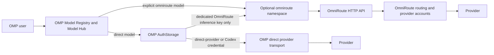

# OmniRoute Integration Evaluation and Plan

**Status:** Proposed for discussion. No implementation is included.

**Source revisions:**

- OMP: [`d17c270090562d730e4d42d1aa3fdd93b45cf41a`](https://github.com/can1357/oh-my-pi/tree/d17c270090562d730e4d42d1aa3fdd93b45cf41a)
- OmniRoute: [`2e8326d5314f171af0d379d8f2900970325a4085`](https://github.com/diegosouzapw/OmniRoute/tree/2e8326d5314f171af0d379d8f2900970325a4085)

## Executive decision

Do **not** replace OMP's provider system. Do **not** add OmniRoute as a git submodule or vendor its runtime. Do **not** move OMP credentials into OmniRoute.

Use this sequence instead:

1. Keep the current OMP provider and authentication system as the permanent default and rollback baseline.
2. Run a laboratory HTTP proof with a user-managed OmniRoute server under a separate `omniroute/*` model namespace.
3. If the proof passes, enforce a router-specific retry budget before publishing a documented, opt-in `models.yml` configuration.
4. Add bounded route visibility only after transport compatibility is proven.
5. Reconsider a managed sidecar or shared routing library only if later demand and a stable upstream package justify their operational cost.

Repository popularity triggered this evaluation. Popularity is not evidence that two independent provider control planes should be merged.

## User contract

The following behavior is non-negotiable:

- Existing OMP providers, model defaults, selection order, and direct transports remain unchanged.
- `/login openai-codex` continues to add multiple ChatGPT/Codex subscription accounts to OMP.
- OMP continues to own OAuth refresh, account identity, session pinning, usage-aware balancing, quota blocks, sibling rotation, usage display, saved reset credits, and reset redemption.
- `omp usage`, `/usage`, `/usage reset`, the status line, and the account selectors continue to describe OMP-owned accounts only.
- OMP never exports its OAuth access tokens, refresh tokens, account database, or usage history to OmniRoute.
- OmniRoute routing is explicit and opt-in only through selectors such as `omniroute/route--<name>`. Every routed model uses a distinct local ID, a separate wire `requestModelId`, and a proposed `qualifiedSelectionOnly` flag. Make every public `ModelRegistry` enumeration method safe-by-default, including `getAvailable()`, `getAll()`, and `getAvailableForProviders()`. Add clearly named full-set methods only for exact `provider/id` resolution, persisted exact session restoration, active exact eval selection, and explicit catalog displays. Provider-wide selection is not sufficient opt-in. Existing models retain identical behavior because the flag defaults off.
- Removing one provider block and selecting a direct model restores the pre-integration state. `/logout` is not part of rollback.

## What each project already owns

### OMP

OMP already has a provider, catalog, credential, and usage architecture:

- `AuthStorage` owns account selection, usage-limit handling, session pinning, multi-account resolution, and saved reset credits ([`auth-storage.ts`](https://github.com/can1357/oh-my-pi/blob/d17c270090562d730e4d42d1aa3fdd93b45cf41a/packages/ai/src/auth-storage.ts#L4507-L4510), [`auth-storage.ts`](https://github.com/can1357/oh-my-pi/blob/d17c270090562d730e4d42d1aa3fdd93b45cf41a/packages/ai/src/auth-storage.ts#L5811-L5839), [`auth-storage.ts`](https://github.com/can1357/oh-my-pi/blob/d17c270090562d730e4d42d1aa3fdd93b45cf41a/packages/ai/src/auth-storage.ts#L5910-L6002)).
- Codex usage and reset behavior are explicit provider contracts ([`openai-codex.ts`](https://github.com/can1357/oh-my-pi/blob/d17c270090562d730e4d42d1aa3fdd93b45cf41a/packages/ai/src/usage/openai-codex.ts#L395-L398), [`openai-codex-reset.ts`](https://github.com/can1357/oh-my-pi/blob/d17c270090562d730e4d42d1aa3fdd93b45cf41a/packages/ai/src/usage/openai-codex-reset.ts#L128-L185)).
- `ModelRegistry.registerProvider()` and custom APIs are runtime extension seams ([`model-registry.ts`](https://github.com/can1357/oh-my-pi/blob/d17c270090562d730e4d42d1aa3fdd93b45cf41a/packages/coding-agent/src/config/model-registry.ts#L2322-L2344), [`api-registry.ts`](https://github.com/can1357/oh-my-pi/blob/d17c270090562d730e4d42d1aa3fdd93b45cf41a/packages/ai/src/api-registry.ts#L71-L99)).
- `models.yml` already supports custom OpenAI-compatible proxies and bounded discovery ([`docs/models.md`](./models.md#proxy-discovery-discoverytype-proxy)).

This is not a missing-provider-abstraction problem. The potential value is optional access to a second router's catalog, translation, and routing policy.

### OmniRoute

OmniRoute is a complete gateway product with its own control plane:

- The published package exposes CLI binaries and a full application payload ([`package.json`](https://github.com/diegosouzapw/OmniRoute/blob/2e8326d5314f171af0d379d8f2900970325a4085/package.json#L1-L39)).
- Its streaming engine package is private, not a supported library contract ([`open-sse/package.json`](https://github.com/diegosouzapw/OmniRoute/blob/2e8326d5314f171af0d379d8f2900970325a4085/open-sse/package.json#L1-L7)).
- Importing its internal barrel patches global `fetch` and pulls application aliases and runtime policy into the process ([`open-sse/index.ts`](https://github.com/diegosouzapw/OmniRoute/blob/2e8326d5314f171af0d379d8f2900970325a4085/open-sse/index.ts#L1-L13), [`proxyFetch.ts`](https://github.com/diegosouzapw/OmniRoute/blob/2e8326d5314f171af0d379d8f2900970325a4085/open-sse/utils/proxyFetch.ts#L1-L26)).
- It exposes a useful OpenAI-compatible process boundary through `/v1/chat/completions` and `/v1/models` ([`chat/completions/route.ts`](https://github.com/diegosouzapw/OmniRoute/blob/2e8326d5314f171af0d379d8f2900970325a4085/src/app/api/v1/chat/completions/route.ts#L31-L89), [`models/route.ts`](https://github.com/diegosouzapw/OmniRoute/blob/2e8326d5314f171af0d379d8f2900970325a4085/src/app/api/v1/models/route.ts#L17-L42)).
- It owns separate connection selection, cooldown, quota, credential persistence, and combo-routing state ([`auth.ts`](https://github.com/diegosouzapw/OmniRoute/blob/2e8326d5314f171af0d379d8f2900970325a4085/src/sse/services/auth.ts#L1279-L1285), [`auth.ts`](https://github.com/diegosouzapw/OmniRoute/blob/2e8326d5314f171af0d379d8f2900970325a4085/src/sse/services/auth.ts#L2600-L2605), [`providers.ts`](https://github.com/diegosouzapw/OmniRoute/blob/2e8326d5314f171af0d379d8f2900970325a4085/src/lib/db/providers.ts#L100-L133), [`combo.ts`](https://github.com/diegosouzapw/OmniRoute/blob/2e8326d5314f171af0d379d8f2900970325a4085/open-sse/services/combo.ts#L703-L715)).

That control plane is valuable. It is also why direct embedding would create overlapping ownership.

## Architecture boundary

OMP remains the outer client and session owner. OmniRoute is a separate optional provider. The routed edge carries only the dedicated OmniRoute inference key; no OMP direct-provider or Codex credential crosses it. Each control plane owns only the accounts that the user configured in that control plane.

## Options considered

| Option | OMP preservation | Value | Cost/risk | Decision |
| --- | ---: | ---: | ---: | --- |
| No integration | Excellent | None | Lowest | Permanent default and rollback baseline |
| Laboratory HTTP proof | Excellent | Medium | Low | **Start here** |
| Documented optional provider configuration | High | High | Medium | Conditional after retry enforcement |
| OMP-managed OmniRoute sidecar | Medium | High | Very high | Defer |
| Import current OmniRoute internals | Low | High | Very high | Reject |
| Git submodule or vendored runtime | Low | Medium | Very high | Reject |
| Replace OMP provider subsystem | None | Medium | Extreme | Reject |

### Why no submodule

A submodule would pin source, not create an API boundary. OMP would inherit a large Next.js/SQLite application, native and optional dependencies, migrations, process lifecycle, global patches, security updates, and release cadence. The only current internal streaming package is private. The stable boundary is HTTP.

### Long-term library possibility

A future small package could be useful if OmniRoute publishes a stable, pure module for route scoring or protocol translation. Candidate leaves include auto-combo scoring and translator registries. OMP should consume such a package only after it has:

- public exports and semantic versioning;
- no database, Next.js, path-alias, process-global, or credential dependencies;
- deterministic inputs and outputs;
- protocol fixtures shared by both projects;
- an explicit ownership and security policy.

OMP should not extract or maintain a fork of that package unilaterally.

## Expected user experience

### Existing direct Codex path

1. The user runs `/login openai-codex` again for each ChatGPT subscription.
2. OMP stores distinct account/workspace identities.
3. OMP selects and pins accounts with its current usage-aware logic.
4. `omp usage` and `/usage` show all OMP accounts and their windows.
5. `/usage reset` lists and redeems OMP saved reset credits.
6. Direct Codex models keep their current status-line, selector, retry, and session behavior.

No OmniRoute setup changes this journey.

### Optional routed path

1. The user starts and configures OmniRoute separately.
2. After the retry-budget prerequisite passes, the user adds an `omniroute` provider to `~/.omp/agent/models.yml`.
3. OMP shows selectors such as `omniroute/route--<name>` in the existing Model Hub and model picker. The distinct local ID maps to OmniRoute's wire model through `requestModelId`. Combo selectors arrive only after Phase 4 gates pass.
4. The user selects a routed model for a session or role. OMP does not change global defaults automatically.
5. Routed turns show a small, sanitized route indicator only when reliable route metadata is available.
6. Router-side account usage remains in OmniRoute. OMP does not mix it into direct Codex usage rows.

### Rollback

1. Select any direct OMP model.
2. Remove any explicit `omniroute/*` role, cycle, or fallback references, then remove the `providers.omniroute` block and its secret reference.
3. Revoke the dedicated inference key separately in OmniRoute.
4. Stop or uninstall OmniRoute separately.

OMP makes no management call during rollback. All OMP login rows, usage history, reset credits, defaults, and direct-provider configuration remain intact.

## Phased plan

### Phase 0 — Laboratory proof and hard gates

**Goal:** Prove the HTTP contract, effective authentication, and total retry budget before publishing any supported user configuration.

Use a user-managed OmniRoute process with a dedicated data directory and a small static route set. Keep remote discovery disabled. This phase is a controlled test fixture, not a supported setup guide.

Required setup and probes:

- Set `OMNIROUTE_SERVER_HOST=127.0.0.1`, `REQUIRE_API_KEY=true`, a dedicated `DATA_DIR`, and a dedicated `STORAGE_ENCRYPTION_KEY`.
- Verify every active listener is loopback-only, including a separate API listener or container port publication.
- Treat runtime behavior as authoritative because OmniRoute feature flags use `DB override > process.env > default` ([`featureFlags.ts`](https://github.com/diegosouzapw/OmniRoute/blob/2e8326d5314f171af0d379d8f2900970325a4085/src/shared/utils/featureFlags.ts#L7-L19)).
- Probe `/v1/chat/completions`, `/v1/models`, and `/v1/combos`: no key and an invalid key must return `401`; the dedicated inference key must succeed. When the effective flag is off, OmniRoute deliberately permits anonymous or invalid-key traffic ([`clientApi.ts`](https://github.com/diegosouzapw/OmniRoute/blob/2e8326d5314f171af0d379d8f2900970325a4085/src/server/authz/policies/clientApi.ts#L57-L99)).
- Disable redirect following for every OmniRoute inference and control-plane probe. Treat every 3xx response as a terminal error and prove that no redirect target receives a request body or key.
- Validate static curated model loading with distinct `route--*` local IDs and separate wire IDs, and prove that remote discovery is not invoked.
- Validate streamed and non-streamed completions, tool calls/results, reasoning, cancellation, images, malformed SSE, session affinity, and 401/404/429/5xx errors.
- Re-run direct OMP provider, Codex account selection, usage, and reset fixtures before and after the routed fixtures.

Measure every retry and reissue layer before accepting the design. OMP currently permits six HTTP attempts ([`openai-http.ts`](https://github.com/can1357/oh-my-pi/blob/d17c270090562d730e4d42d1aa3fdd93b45cf41a/packages/ai/src/utils/openai-http.ts#L26-L33)), one provider-error replay ([`openai-completions.ts`](https://github.com/can1357/oh-my-pi/blob/d17c270090562d730e4d42d1aa3fdd93b45cf41a/packages/ai/src/providers/openai-completions.ts#L1460-L1462)), and up to two empty-completion replays ([`empty-completion-retry.ts`](https://github.com/can1357/oh-my-pi/blob/d17c270090562d730e4d42d1aa3fdd93b45cf41a/packages/ai/src/utils/empty-completion-retry.ts#L19-L19), [`empty-completion-retry.ts`](https://github.com/can1357/oh-my-pi/blob/d17c270090562d730e4d42d1aa3fdd93b45cf41a/packages/ai/src/utils/empty-completion-retry.ts#L136-L153)). Reasoning-effort rejection and strict-tools rejection can each call `createCompletionsStream()` again ([`openai-completions.ts`](https://github.com/can1357/oh-my-pi/blob/d17c270090562d730e4d42d1aa3fdd93b45cf41a/packages/ai/src/providers/openai-completions.ts#L777-L822)); provider-file, URL, and inline image fallback can re-call the stream before content ([`stream-fallback.ts`](https://github.com/can1357/oh-my-pi/blob/d17c270090562d730e4d42d1aa3fdd93b45cf41a/packages/coding-agent/src/blob-broker/stream-fallback.ts#L21-L73)); Harmony leak mitigation can re-enter the same agent turn ([`agent-loop.ts`](https://github.com/can1357/oh-my-pi/blob/d17c270090562d730e4d42d1aa3fdd93b45cf41a/packages/agent/src/agent-loop.ts#L1189-L1237)); and session recovery can retry the turn. OmniRoute combos add their own target, credential, and provider retry loops. Its `maxGlobalAttempts` limits combo target attempts, not necessarily actual executor dispatches.

Adopt this target for Phase 1:

- one stable OMP ledger per planned provider sub-operation permits one outbound router request across every retry or repair of that sub-operation. Multi-stage work such as compaction allocates separate ledgers for each planned main, split-window, and short-summary request;
- zero OMP network reissues for an `omniroute/*` request;
- at most three actual upstream executor dispatches per OmniRoute combo invocation. A normal OMP turn may contain multiple legitimate tool-result or protocol-continuation operations, each with its own bounded ledger;
- a stopped loopback router returns control within five seconds in the failure fixture.

Phase 0 measures the stock path and can record counts above this target. That does not block Phase 1 when the transport and auth contracts pass and the retry layers have a clear enforcement seam. It does block all supported configuration until Phase 1 proves the target.

**Kill gates:**

- an attempt layer cannot be measured or attributed;
- no router-specific enforcement path exists without changing direct-provider defaults;
- any OMP direct-provider or subscription credential material, account identity, or usage state is transmitted to or referenced by OmniRoute; the dedicated OmniRoute inference key is the only credential allowed across this HTTP boundary;
- direct-provider defaults or selection order change;
- a routed model shadows a direct provider ID;
- tools, streaming, cancellation, reasoning, usage, or error classification lose information;
- an absent router causes hidden probes, process starts, or startup delays;
- any auth-negative probe does not return `401`.

**Deliverable:** A compatibility matrix, captured wire fixtures, baseline attempt counts, auth-probe receipts, and a retry-enforcement feasibility decision. No supported configuration is published.

### Phase 1 — Routing safety prerequisites

Proceed when Phase 0 passes its transport and authentication gates and identifies every reissue path. The stock retry-count fixture is expected to exceed the future budget.

- Create one router-specific logical-operation attempt ledger outside the replay wrappers and preserve it across every same-operation retry boundary.
- For routed requests, set `fetchWithRetry.maxAttempts: 1` and `redirect: "error"`. Immediately before that single fetch, atomically consume the sub-operation's ledger at the outbound HTTP edge. Every wrapper only propagates or idempotently validates the reservation; higher-level re-entry of the same sub-operation sees an exhausted ledger. A redirect is a terminal transport error and cannot resend the body or dedicated key. Existing providers retain six transport attempts and their current redirect behavior.
- Carry each ledger through transport retries, provider-error replay, empty-completion replay, reasoning-effort fallback, strict-tools fallback, image fallback, agent-loop repair, oneshot/direct loops, handoff fallback, rejected-window replan, auto-compaction outer/candidate retry, and turn recovery. A normal tool-result or protocol continuation and each legitimate planned compaction sub-operation receive separate fresh one-request ledgers. Retrying, repairing, or replacing the same rejected sub-operation reuses its consumed ledger.
- As defense in depth, set provider-error and empty-completion replay to zero for routed models.
- Add 5xx/429, empty `200`, reasoning-rejection `400`, strict-tools `400`, image-source rejection, Harmony leak, unmet/wrong forced-tool, truncated-tool-call, transient oneshot, conventional-commit transient/empty/parse failure, handoff tool-choice rejection, compaction-window overflow/replan, auto-compaction transient/usage-limit candidate fallback, and retryable-turn fixtures; each same logical operation must observe exactly one outbound router request.
- Require an OmniRoute route contract that enforces or inference-safely attests a maximum of three actual executor dispatches. `maxGlobalAttempts <= 3` alone is not sufficient.
- Expose `requestModelId` for custom `models.yml` definitions and preserve it through model patching and custom-model overlays.
- Require every routed model to use a distinct local `route--*` ID. Keep the upstream OmniRoute model or route name only in `requestModelId`.
- Add an MRU regression: select an explicit routed model, then select the bare upstream ID; the bare selector must still choose a direct provider.
- Do not infer runtime behavior from `requestModelId`. Introduce a versioned stable `ModelFamily` enum with documented compatibility policy, including `mixed` and `unknown`. Existing identity classifiers map into that enum at build time; their free-form tokens are not persisted directly. Every routed entry explicitly materializes stable `modelFamily`, reasoning/thinking, capabilities, limits, cost, compat, tokenizer/glyph policy, and dialect. Runtime consumers read materialized fields; identity classifiers remain build/materialization or legacy string-only helpers.
- Add provider-specific validation: every final `omniroute` model definition must have `qualifiedSelectionOnly: true`. Reject missing or false values after provider/model overlays merge, and force discovered routed entries through the same validation.
- Audit every model-enumeration call site. Automatic/default/fallback and provider-wide callers keep safe APIs. Only explicit model pickers, catalog displays, exact `provider/id` resolution, persisted exact session restoration, and active exact eval selection may use a clearly named full-set API.
- Add resolver and caller regressions after MRU use and with direct models unavailable. Bare exact/fuzzy selectors, CLI-flat lookup, default selection, automatic role defaults/aliases, unqualified cycles, smol/slow fallback, Agents Hub, image inspection, attached-image vision fallback, ACP, bench, and an only-routed-model candidate set must never select a qualified-only model. Exact `omniroute/route--*` selectors in direct, role, and cycle settings must still resolve.
- Cover automatic `getAll()` paths in memories, render CLI, and bench. With only qualified models present, each must decline automatic selection; explicit exact selection and explicit catalog display must still work.
- Add an SDK regression for `explicitDefaultProviders: [\"omniroute\"]`: provider-wide preference alone must not select a qualified-only route; an exact `omniroute/route--*` selector remains required.
- Do not add OmniRoute to OMP fallback chains automatically.
- When the ledger blocks same-operation recovery, surface a deterministic consumer-visible terminal error instead of an internal ledger exception, hang, or dropped result. Preserve the original provider status/code when present, mark recovery as budget-suppressed, and use one stable error code for otherwise unclassified repair failures.

**Acceptance:** Each logical operation observes one OMP outbound router request and no more than three actual OmniRoute executor dispatches per combo invocation. Legitimate tool/protocol continuations receive fresh bounded ledgers. Every blocked-recovery fixture asserts both request count and the consumer-visible terminal result. Selector, metadata, and direct-provider snapshots remain unchanged, and the stopped-router fixture returns within five seconds.

**Kill gate:** If either control plane cannot enforce and expose its side of the budget without changing direct-provider defaults, stop and keep the experiment unsupported.

### Phase 2 — Documented loopback provider configuration

Proceed only after Phases 0 and 1 pass.

- Reuse OMP's existing OpenAI-compatible transport with static curated direct, non-combo routes. Each entry uses a distinct local ID, wire-only `requestModelId`, `qualifiedSelectionOnly: true`, stable versioned `modelFamily`, explicit tokenizer/glyph/dialect policy, and complete capability, limit, cost, and compatibility metadata.
- Reject any `omniroute` model or override whose merged result omits `qualifiedSelectionOnly: true`; examples alone are not sufficient enforcement.
- Do not advertise zero-config `auto`.
- A combo can be supported only after OmniRoute provides a stable, inference-safe contract that proves its effective actual executor-dispatch cap is at most three. A configured `maxGlobalAttempts` value alone is not proof.
- Use the `omniroute/*` provider namespace plus distinct local IDs, and keep router credentials separate from `openai-codex`.
- Keep the first supported surface loopback-only.
- Enforce the loopback boundary in configuration: when the provider id is `omniroute`, reject every non-loopback `baseUrl` at config load until Phase 5 implements remote HTTPS and certificate validation. Accept only `localhost`, `127.0.0.0/8`, and `::1` loopback forms.
- Disable redirect following for OmniRoute chat, model, combo, and authentication requests. Loopback validation applies to the original URL and is not satisfied by validating a redirect target.
- Store the key through an environment-variable name or command-backed secret reference.
- Run the three negative/positive auth probes during setup validation; setting an environment flag alone is insufficient.
- Do not install, start, stop, upgrade, or migrate OmniRoute.
- Do not add a new authentication branch; use the existing API-key provider contract.
- If maintainers later want a built-in provider, treat it as a separate decision with the complete catalog descriptor, generated default model, AI registry, changelog, and test contracts.

**Kill gate:** Any required change to `AuthStorage`, Codex login, Codex usage/reset, direct stream dispatch, or OmniRoute internals cancels this phase.

### Phase 3 — Route explainability

Proceed only after transport parity and retry enforcement.

- Evaluate and stability-gate the existing `X-OmniRoute-Decision` and `X-OmniRoute-Fallback-Attempts` headers. They contain sanitized strategy, provider alias, latency, and fallback counts ([`omnirouteResponseMeta.ts`](https://github.com/diegosouzapw/OmniRoute/blob/2e8326d5314f171af0d379d8f2900970325a4085/src/domain/omnirouteResponseMeta.ts#L82-L113), [`omnirouteResponseMeta.ts`](https://github.com/diegosouzapw/OmniRoute/blob/2e8326d5314f171af0d379d8f2900970325a4085/src/domain/omnirouteResponseMeta.ts#L143-L186)).
- Use the existing provider-response `onResponse` seam unchanged; allowlist the routing headers downstream in `agent-loop` ([`provider-response.ts`](https://github.com/can1357/oh-my-pi/blob/d17c270090562d730e4d42d1aa3fdd93b45cf41a/packages/ai/src/utils/provider-response.ts#L3-L29)).
- Treat the combo trace header as an opaque invocation ID.
- Do not give OMP an OmniRoute management token and do not call the management-authenticated trace route ([`combo-trace route`](https://github.com/diegosouzapw/OmniRoute/blob/2e8326d5314f171af0d379d8f2900970325a4085/src/app/api/usage/combo-trace/%5Bid%5D/route.ts#L1-L24)).
- Add a typed, persisted assistant route-metadata field so live and rebuilt transcripts match.
- Render one dim routed-turn row. Exclude credentials, account IDs, raw headers, prompts, and provider-private diagnostics.

No new dashboard is required.

### Phase 4 — Bounded combo discovery

Proceed only after real usage demonstrates demand.

- Use the API-key-safe `GET /v1/combos` contract, not the management API, through the same OmniRoute-only redirect-rejecting client used by setup validation ([`combos route`](https://github.com/diegosouzapw/OmniRoute/blob/2e8326d5314f171af0d379d8f2900970325a4085/src/app/api/v1/combos/route.ts#L1-L58)).
- Import only user-created combo IDs and advertised capabilities, not the full provider catalog. Project each combo to a distinct local ID such as `route--combo--<name>`, keep the original combo name only as its wire `requestModelId`, and set `qualifiedSelectionOnly: true`. OmniRoute's public projection strips connection IDs, weights, and internal labels ([`projectCombo.ts`](https://github.com/diegosouzapw/OmniRoute/blob/2e8326d5314f171af0d379d8f2900970325a4085/src/app/api/v1/combos/projectCombo.ts#L1-L56)).
- Do not synthesize metadata from a combo's wire ID. Support a discovered combo only when the inference-safe contract or explicit user configuration supplies complete validated metadata. Heterogeneous combos use stable `ModelFamily.Mixed` and generic `xml`; unclassifiable homogeneous routes use `ModelFamily.Unknown` with documented provider-fallback semantics.
- The current projection does not expose the effective executor-dispatch budget. Keep every combo, including zero-config `auto`, unsupported until a stable inference-key-safe contract attests and enforces at most three actual executor dispatches.
- Cache with a timeout and preserve the last known good list on transient failure.
- Keep explicit configured routes available when discovery is offline.
- Never translate router-owned providers into OMP-owned login entries.

### Phase 5 — Managed sidecar or remote-server decision

This is a separate future decision, not an assumed destination.

Consider an OMP-managed sidecar only if adoption and platform support justify it. OMP may manage only the child process it started. It must never adopt or stop a user-managed PID. Readiness must use an authenticated probe, and every managed instance needs an exclusive data directory.

Remote support also requires a separate gate: reject non-HTTPS URLs, validate the certificate, and prove no key/invalid key returns `401` while the dedicated key succeeds.

Otherwise keep the process user-managed and loopback-only.

## Security and operations

- OmniRoute is trusted local code. A process under the same OS identity can potentially read other user files. A separate `DATA_DIR` prevents accidental sharing; it is not a hostile-process sandbox.
- The integration must transmit or reference zero OMP direct-provider or subscription credential material. The dedicated OmniRoute inference key is the sole allowed credential crossing this boundary. If hostile-process isolation is required, run OmniRoute under a separate OS identity or container with no `~/.omp` mount.
- Set and verify `OMNIROUTE_SERVER_HOST=127.0.0.1`; also verify `API_HOST` or container host publication when a separate listener is active.
- Keep remote support disabled until the HTTPS and auth preflight exists.
- Never follow an OmniRoute redirect. A loopback endpoint can otherwise redirect a `POST` and its dedicated key or request body to a remote host.
- Set `models.yml` `apiKey` to an environment-variable name or command-backed secret reference; do not commit or paste a literal token.
- Give OmniRoute a dedicated `DATA_DIR` and `STORAGE_ENCRYPTION_KEY`. Never point its data directory at `~/.omp`, and never copy OMP database or environment files into it.
- During rollback, OMP removes only its configuration and secret reference. The user revokes the dedicated key separately in OmniRoute; OMP makes no management call.
- Never share OMP's `agent.db`, OAuth records, refresh tokens, account IDs, or usage history.
- Do not create fallback loops in which OMP and OmniRoute can dispatch to the same OMP-controlled credential.
- Preserve terminal status/code and an allowlisted recovery state. Route every displayed or persisted detail through the repository's shared `replaceTabs()` and `truncateToWidth()`/`ui.truncate()` helpers with shared truncation constants such as `TRUNCATE_LENGTHS` or `PREVIEW_LIMITS`. Strip ANSI/control sequences through the existing sanitizer path; do not use an ad hoc character cap.
- Record which control plane owns each rate limit and reset time.
- A future sidecar manager may stop only its verified child process.
- Preserve OmniRoute's MIT notice if a future approved package copies substantial code.

## Proposed implementation targets

These are candidate files, not approved changes:

- `docs/models.md` — loopback-only configuration, ownership warning, auth probes, and rollback.
- `packages/coding-agent/src/config/models-config-schema-bundle.ts` — router budgets, `requestModelId`, `qualifiedSelectionOnly`, explicit tokenizer/glyph policy, provider-id-specific loopback validation, and rejection of missing/false qualified-only values for final `omniroute` entries.
- `packages/coding-agent/src/config/model-patch.ts` and `custom-models.ts` — preserve distinct local/wire IDs, propagate qualified-only selection, tokenizer policy, and glyph-tokenization policy, require complete explicit routed metadata, and never use `requestModelId` as a catalog reference.
- `packages/coding-agent/src/config/model-registry.ts` — make every public enumeration API safe-by-default, add clearly named explicit full-set methods, validate merged routed models, prevent overrides from clearing qualified-only status, force discovery through the same invariant, and keep discovery disabled until Phase 4.
- Repository-wide model-enumeration callers — classify every `getAvailable()`, `getAll()`, and `getAvailableForProviders()` use as automatic/provider-wide or explicitly authorized. Safe callers remain on default APIs; only exact qualified resolution, persisted exact restoration, active exact eval, and catalog display migrate to full sets.
- The initial closed-set audit covers `sdk.ts` provider-wide/default and deferred-selector paths, `session/agent-session.ts` persisted exact restoration, `eval/completion-bridge.ts` active exact selection, auth-gateway CLI, bench, render CLI, memories, model resolver, xAI HTTP helpers, Model Hub, model picker, setup wizard, and image generation. Each site must explicitly choose safe candidates or a full set justified by exact selection/catalog display.
- Add a lint or typed wrapper rule so future model-enumeration callers cannot consume the full qualified catalog without an explicit API name and review.
- `packages/ai/src/types.ts` — define shared logical-operation ledger state, stable materialized family/dialect fields, and persisted assistant route metadata.
- `packages/ai/src/utils/openai-http.ts` — set routed `fetchWithRetry.maxAttempts` to one and `redirect` to `"error"`, atomically consume the ledger immediately before the sole fetch, skip retry sleep after failure, and preserve the existing defaults elsewhere.
- New `packages/coding-agent/src/config/omniroute-validation.ts`, called by `cli/setup-cli.ts`, the setup wizard, and Phase 4 discovery — centralize OmniRoute-only chat, `/v1/models`, `/v1/combos`, and authentication probes with `redirect: "error"`. Do not put this policy on the generic direct-provider client.
- `packages/coding-agent/src/memories/index.ts`, `cli/render-cli.ts`, and `cli/bench-runtime.ts` — remove automatic `getAll()[0]` or unqualified full-catalog fallback and use safe candidates.
- `packages/coding-agent/src/session/agent-session.ts` and `eval/completion-bridge.ts` — use the explicit full set only to restore a persisted exact routed selector or preserve the active exact routed model; automatic/default eval fallbacks remain safe.
- `packages/catalog/src/types.ts`, `build.ts`, and `identity/family.ts` — define a versioned stable `ModelFamily` enum, map existing classifier output at build time, add qualified/tokenizer/glyph/dialect controls, retain wire-only `requestModelId`, and add typed router budgets. The existing comparison-only token is never persisted directly.
- `packages/ai/src/providers/openai-completions.ts` — share the budget across transport, reasoning-shape, strict-tools, provider-error, and empty-completion paths.
- `packages/ai/src/utils/empty-completion-retry.ts` — consume or honor the shared budget only if the existing caller policy cannot disable routed empty replay.
- `packages/ai/src/oneshot-retry.ts` — accept the routed logical-turn ledger or routed model policy and cap transient oneshot completion to one outbound request.
- `packages/agent/src/telemetry.ts`; coding-agent `auto-thinking/classifier.ts`, `commit/changelog/generate.ts`, `edit/auto-repair.ts`, `memories/index.ts`, `mnemopi/backend.ts`, `session/unexpected-stop-classifier.ts`, `tts/speech-enhancer.ts`, `utils/commit-message-generator.ts`, and `utils/title-generator.ts`; and `packages/mnemopi/src/core/local-llm.ts` — pass the routed model/ledger classification into every current production `retryTransientCompletion()` call.
- Make the oneshot retry classification a typed call-site requirement so type checking closes the set. Any future caller must preserve the ledger or prove that a qualified-only model cannot reach it.
- `packages/coding-agent/src/commit/conventional/inference.ts` — preserve the shared ledger across its direct `completeSimple()` retry loop or force one attempt for qualified routed models.
- Repository-wide direct `completeSimple()`/`streamSimple()` loop audit — every same-operation loop must preserve the ledger or prove qualified routed models cannot reach it.
- `packages/coding-agent/src/session/turn-recovery.ts` — preserve the same routed-turn budget across whole-turn recovery without changing direct defaults.
- `packages/coding-agent/src/blob-broker/stream-fallback.ts` — carry the shared logical-turn ledger through provider-file, URL, and inline image-source fallback.
- `packages/agent/src/agent-loop.ts` — preserve the routed ledger through same-operation repairs; create a fresh ledger for successful tool-result, `pause_turn`, and user steering/follow-up/aside continuations; also allowlist safe routing headers from the unchanged provider-response seam.
- `packages/agent/src/compaction/compaction.ts` and branch-summarization paths — read materialized `model.dialect`; allocate stable ledgers per planned main/split/short-summary sub-operation; preserve each across handoff, rejected-window repair, outer retry, and candidate fallback.
- `packages/coding-agent/src/session/session-maintenance.ts` — preserve the per-sub-operation ledger map across auto-compaction outer retry and candidate fallback; automatic candidates remain safe while exact routed compaction roles stay explicit.
- `packages/agent/src/compaction/branch-summarization.ts`; `packages/ai/src/dialect/demotion.ts`, `utils/harmony-leak.ts`, and `utils/thinking-loop.ts`; coding-agent `sdk.ts`, `session/agent-session.ts`, `session/session-maintenance.ts`, `config/inline-tool-descriptors-mode.ts`, `session/stream-guards.ts`, and `extensibility/extensions/model-api.ts` — replace runtime family/dialect inference from local or wire IDs with materialized `model.modelFamily` and `model.dialect`.
- Repository-wide runtime model-identity audit/lint — routed `Model` consumers must read materialized family/capability/dialect/tokenizer/glyph fields instead of classifying local or wire IDs.
- `packages/coding-agent/src/modes/components/assistant-message.ts` or the existing usage row — render route metadata through live and rebuild paths using shared `replaceTabs()`, ANSI/control sanitization, `truncateToWidth()`/`ui.truncate()`, and repository truncation constants.

The first implementation PR must not change direct-provider defaults or behavior and must not touch Codex-specific auth, usage, or reset files. Shared transport and recovery files may receive inert optional controls.

## Test and evidence plan

### Must remain green

- Codex multi-account selection and organization-scoped identity tests.
- OAuth account selection, refresh, sibling rotation, session pinning, and usage ranking tests.
- Codex usage, reset-credit, reset-selector, status-line, and CLI usage tests.
- Model Hub, picker, provider-error, retry-fallback, and transcript rebuild tests.

### New contract tests

- Supported config does not change defaults or direct models.
- `omniroute/*` cannot collide with built-in selectors.
- Missing router is lazy and does not delay startup.
- Routed requests preserve tools, streaming, cancellation, reasoning, usage, and errors.
- The initial routed request succeeds with a one-unit ledger and records exactly one debit immediately before the fetch; wrapper propagation never double-consumes it.
- Routed 5xx and network-error fixtures invoke fetch once and perform no internal retry sleep; non-routed transport retains six-attempt behavior.
- Missing and invalid keys return `401` for chat, models, and combos; the dedicated key succeeds.
- Config validation rejects remote HTTP and HTTPS OmniRoute URLs during the loopback-only phase and accepts supported loopback spellings.
- Chat, models, combos, and auth-probe fixtures return each supported redirect status to a remote mock. OMP treats each response as terminal, the remote mock receives zero requests, bodies, and credentials, and the surfaced error is deterministic and sanitized.
- A non-OmniRoute redirect fixture records the current direct-provider result before the shared transport edit and proves that result remains unchanged afterward.
- Route metadata is allowlisted, sanitized, bounded, and identical in live/rebuilt transcripts.
- Removal mutates no authentication state, removes the OMP secret reference, makes no management call, and leaves direct-provider configuration valid.
- After a routed selector enters MRU history, the same bare upstream ID still resolves to a direct provider.
- Every blocked-recovery fixture asserts a deterministic consumer-visible error or preserved terminal state, including original status/code when available and a budget-suppressed marker. It must not expose an internal ledger error, hang, or drop the result.
- Route-detail fixtures include tabs, ANSI sequences, control characters, and wide Unicode, and assert the shared TUI sanitizer/truncation contract in live and rebuilt transcripts.
- Configured and discovered routed entries retain distinct local IDs while serializing `requestModelId` on the wire.
- Distinct routed IDs keep their explicitly configured capabilities, limits, costs, and compatibility fields without inheriting metadata from `requestModelId`.
- Routed entries use explicit tokenizer, glyph-tokenization, and dialect policies. Token counting, compaction serialization, and Harmony tests prove that `requestModelId` controls only wire serialization.
- Ordinary routed compaction completes its main and short summaries with two separate ledgers; split-turn compaction completes two parallel summaries plus the short summary with three. Retry/candidate fallback cannot reissue any consumed sub-operation.
- Routed family and opaque combo fixtures prove stable family validation, extension `ctx.models.family()`, thinking-loop behavior, tool encoding, demotion, interrupted thinking, compaction/branch serialization, snapcompact, stream guards, and Harmony all use explicit materialized family/dialect metadata.
- Family compatibility tests cover invalid values, `mixed`, `unknown`, build-time mapping, schema-version migration, and existing unclassified models retaining provider-fallback behavior.
- With direct models unavailable or only routed models present, every automatic/default/fallback caller using model enumeration receives no qualified-only model. Memory fallback/requested-model, render CLI, bench, and SDK deferred-selector fixtures cover current mixed/automatic paths. Persisted routed session restore and active routed eval keep the exact model through explicit full-set APIs; automatic eval fallback stays unqualified.
- Auth-gateway and provider-specific helper fixtures prove either that local qualified models are absent by construction or that exact provider/id matching is used without unqualified fallback.
- SDK `explicitDefaultProviders: [\"omniroute\"]` with only qualified routes selects nothing; an exact routed model selector still works.
- Config and overlay tests reject every `omniroute` model whose final merged `qualifiedSelectionOnly` value is missing or false; discovered routed entries cannot bypass the invariant.
- Save/resume restores an exact persisted `omniroute/route--*` model, and routed-session eval uses the same active exact model. No-selector or configured-default eval paths cannot select a qualified-only route.

### Proposed proof thresholds

These thresholds need maintainer agreement before implementation:

- 100% pass rate on the defined transport fixture matrix.
- Zero changes to direct Codex account selection, usage, or reset snapshots.
- Routed transport uses `maxAttempts: 1`, one fetch invocation, and no transport retry sleep; higher-level re-entry is rejected by the exhausted ledger.
- Zero OMP direct-provider or subscription credential material transmitted to or referenced by the integration; only the dedicated OmniRoute inference key crosses.
- No default model, role, cycle order, or fallback-chain change.
- Exactly one router request per logical provider sub-operation. Legitimate tool/protocol continuations and planned compaction main/split/short requests start separate bounded ledgers; repair or retry of a rejected sub-operation reuses the consumed ledger.
- A supported direct route performs one actual OmniRoute executor dispatch per operation; a later supported combo performs at most three per invocation through an attested hard budget.
- A stopped loopback router returns control within five seconds in the controlled fixture.
- No-key and invalid-key probes return `401` on all three supported OmniRoute routes.
- The loopback-only schema rejects every non-loopback OmniRoute URL before any prompt, image, or key can be sent. OmniRoute inference and control-plane requests follow zero redirects, and a redirect target receives zero requests, bodies, or credentials.
- A recorded non-OmniRoute redirect baseline remains unchanged; redirect rejection is an `omniroute` provider policy, not a new global fetch default.
- Local router overhead target: no more than 25 ms p50 and 75 ms p95 in a controlled loopback fixture. Warm both processes, send at least 100 identical streaming and non-streaming requests through a stub upstream, and compare routed latency with the direct OMP baseline so model latency is excluded.
- Routed metadata is explicit and validated; `requestModelId` controls wire serialization only and never catalog, family, tokenizer, glyph, dialect, or Harmony classification.
- Runtime model-aware consumers read stable materialized `ModelFamily` and other fields. A lint/audit gate restricts free-form identity inference to build/materialization or legacy string-only boundaries.
- `qualifiedSelectionOnly` defaults off and changes no existing model. Every public registry enumeration API is safe-by-default; only clearly named explicit-selection/catalog APIs can expose qualified-only models.
- Every final `omniroute` entry has `qualifiedSelectionOnly: true`; missing/false config, overrides, and discovery output fail before model selection.
- Repository lint/type gates reject new full-catalog enumeration unless the caller uses the explicit full-set API and is allowlisted as an exact selector, persisted exact restoration, active exact eval, or catalog display.
- Harmony leak, soft-tool requirement, and truncated-tool-call resampling preserve the same ledger and cannot create a second OmniRoute request.
- Successful tool-result, `pause_turn`, and user steering/follow-up/aside operations receive fresh ledgers for their legitimate continuations.
- Positive role/cycle fixtures prove that exact qualified-only selectors remain explicit opt-in while unqualified aliases and fallbacks do not.
- Oneshot helpers and explicit routed tiny/smol/commit/utility roles preserve the same ledger and cannot create a second OmniRoute request.
- Conventional commit inference and every audited direct completion loop preserve the ledger and cannot create a second OmniRoute request.
- Handoff tool-choice fallback preserves the same ledger and cannot create a second OmniRoute request.
- Auto-compaction transient/usage-limit and candidate fallback preserve the stable per-sub-operation ledger map. Automatic candidates stay unqualified unless an exact routed compaction role was authored.
- Rejected-window replanning cannot reissue a consumed sub-operation. Ordinary and split-turn planned summary stages each receive their own fresh one-request ledger.

## Explicit non-goals

- No provider-system replacement.
- No global bare-ID or fuzzy-match precedence change for existing models; only explicitly qualified-only routed models are excluded.
- No shared credential database.
- No automatic credential migration.
- No automatic fallback to OmniRoute.
- No automatic OmniRoute installation or daemon management in the first implementation.
- No full 356-provider import.
- No OmniRoute dashboard, MCP, A2A, memory, compression, policy, or desktop embedding.
- No new OMP setup screen until documented loopback configuration shows real adoption.

## Questions for maintainers

### OMP

- Is one shared OMP router request, zero network reissues, one direct executor dispatch, and at most three later combo dispatches an acceptable hard budget?
- Is exposing `requestModelId` in custom `models.yml` definitions acceptable as the selector-isolation contract?
- Should the first supported surface remain `models.yml`, or should a built-in descriptor be considered in a later separate proposal?
- Is complete explicit metadata for every routed local ID acceptable, with no catalog inheritance from `requestModelId`?
- Which existing assistant metadata row should carry the allowlisted decision, fallback-count, and opaque trace fields?
- Should provider-wide defaults remain insufficient for OmniRoute opt-in, requiring exact `provider/id` even when `explicitDefaultProviders` names `omniroute`?
- Is an opt-in `qualifiedSelectionOnly` model field acceptable for excluding routed entries from every unqualified resolver phase?
- Should the `omniroute` provider id enforce `qualifiedSelectionOnly: true` as a non-overridable schema/runtime invariant?
- Is `disableTokenizerInference: true` an acceptable explicit generic tokenizer policy for heterogeneous routed models and combos?
- Is an explicit `dialect` field on routed `ModelSpec` acceptable, with `xml` as the deliberate generic policy for heterogeneous combos?
- Is a new versioned stable `ModelFamily` enum acceptable, with `mixed` and `unknown` plus documented migration and provider-fallback behavior?
- Which direct Codex and fallback suites should be mandatory gates for every later implementation phase?
- Are safe-default `ModelRegistry.getAvailable()`/`getAll()` plus clearly named explicit full-set APIs acceptable as the repository-wide guard against unknown automatic callers?
- Is exposing `requiresGlyphTokenization` on custom `ModelSpec` acceptable so routed Claude-family entries do not depend on local-ID classification?
- Which lint/type boundary should prevent runtime `Model` consumers from calling identity classifiers instead of reading materialized metadata?

- Should `OneshotRetryOptions` accept the shared logical-turn ledger directly, or should routed model policy force `maxAttempts: 1` through one central helper?
- Should direct completion loops receive the ledger through `completeSimple` options, or should qualified routed policy centrally force one attempt?

### OmniRoute

- Are `/v1/chat/completions`, `/v1/models`, `/v1/combos`, `X-OmniRoute-Decision`, `X-OmniRoute-Fallback-Attempts`, and `X-OmniRoute-Combo-Trace` stable compatibility contracts?
- Can `/v1/combos` or another inference-key-safe contract attest and enforce the maximum actual executor dispatches, distinct from `maxGlobalAttempts`?
- Which projected combo classes should OMP expose from the existing authenticated `/v1/combos` list?
- Is a future public, pure routing or translation package planned?
- What minimum process readiness, shutdown, listener-binding, and data-directory guarantees are supported for sidecar users?

## Requested review

- OMP architecture and product direction: @can1357
- OmniRoute integration contract: @diegosouzapw
- Automated architecture and regression review: @codex

The requested review is plan-only. It must not start implementation until maintainers agree on Phase 0, ownership boundaries, proof gates, and stop conditions.
