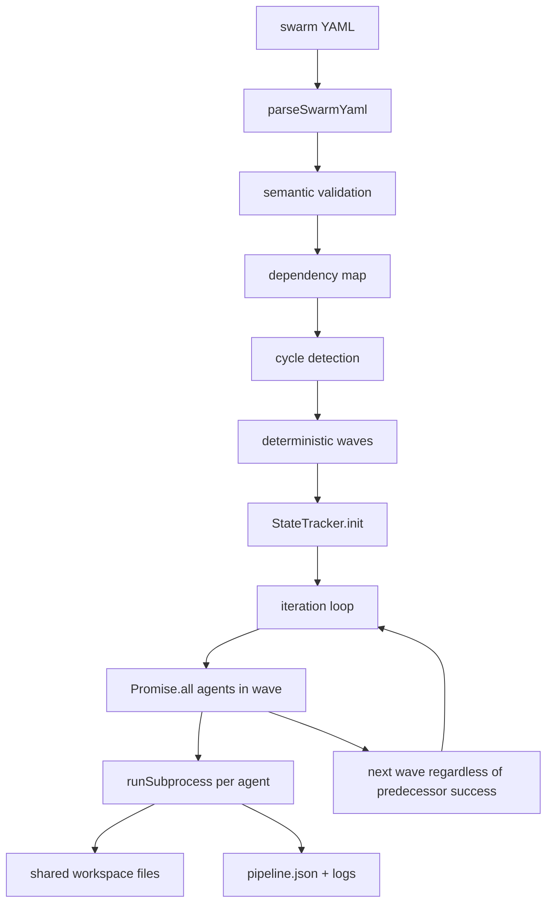
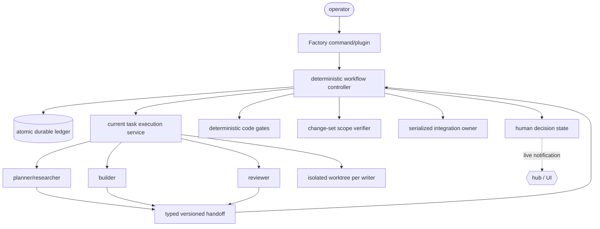

# OMP Swarm Archaeology + Factory Integration Audit

> **Decision:** do not depend on `@oh-my-pi/swarm-extension` or vendor its last tree. Preserve the current ADW prototype until a thin external Factory controller proves equivalent. Reuse Swarm's declarative DAG vocabulary as design evidence, not as a runtime dependency.
>
> **Scope:** repository history through OMP 18.1.15, npm metadata, the last in-tree Swarm source, current `task`/`hub`, the merged ADW prototype, and disposable behavioral experiments. SSSF and Fusion Harness are references only.

---

## 1. Executive verdict

Swarm was real. It was merged, documented, versioned in-tree through 17.2.8, and published to npm through 13.17.0. The earlier conclusion that it never existed was false because it searched only the current tree.

Swarm is not a viable current dependency:

- commit `b0a94a8fc003dfa1164cca6c508772577f68ec7b` deleted the package, tests, and documentation on 2026-08-05;
- tag `v17.2.8` contains the package; `v17.2.9` does not;
- npm's latest remains 13.17.0, published 2026-03-30, with peer dependency `@oh-my-pi/pi-coding-agent: ^13` while current OMP is 18.1.15;
- npm carries no deprecation notice, and open issue #7895 has no maintainer roadmap answer;
- the last source has deterministic DAG ordering, but no usable workflow resume, typed handoff, write isolation, human approval gate, deterministic acceptance gate, or dependency-success propagation.

Swarm and `task` occupy different layers:

- `task` is the maintained execution/lifecycle primitive: clean child sessions, schemas, artifacts, async jobs, continuation, IRC, bounded concurrency, and optional isolated worktrees;
- Swarm was a small workflow scheduler over the older public `runSubprocess` API;
- the Factory still needs a deterministic workflow controller, but it must sit above current `task` semantics rather than revive Swarm's older executor wrapper.

---

## 2. Repository and package archaeology

### Timeline

| Date | Evidence | Status |
|---|---|---|
| 2026-02-12 | PR #26 merged: `feat(coding-agent): add swarm extension for multi-agent pipeline orchestration` | First-party, in-tree |
| 2026-02-12 | `3e18641a...` moved `packages/omp-extension-swarm` to `packages/swarm-extension` and added `omp-swarm` | Packaged CLI + extension |
| 2026-02-12 | npm 11.14.3 published | Published |
| 2026-02-27 | PR #184 added per-agent model overrides | Maintained feature work |
| 2026-03-30 | npm 13.17.0 published | Last registry release |
| 2026-04-28 | issue #856 reported in-tree 14.5.3 missing from publish and tarball-test lists | In-tree, no longer shipping to npm |
| 2026-06-04 | PR #1726 fixed TUI auth-storage/model-registry identity failure | Maintained in-tree fix |
| 2026-07-05 | changelog 16.3.7 fixed the coding-agent peer range to `^16` | In-tree compatibility maintenance |
| 2026-07-29 | PR #7021 proposed human gates/discovery/cross-process control; closed unmerged with correctness findings | Missing capabilities acknowledged, not landed |
| 2026-08-03 | PR #7463 proposed dependency-failure propagation; closed after package removal | Known scheduler correctness gap, not landed |
| 2026-08-05 | `b0a94a8... chore: cleanup` deleted all Swarm code/tests/docs | Removed from mainline |
| 2026-08-07 | issue #7895 asked whether it would return; still open | Roadmap unknown |

### npm lifecycle

Registry metadata on the audit date:

- package: `@oh-my-pi/swarm-extension`;
- versions: 128 releases, 11.14.3 through 13.17.0;
- created: 2026-02-12;
- last modified/released: 2026-03-30;
- `dist-tags.latest`: 13.17.0;
- deprecation message: none;
- latest peer: `@oh-my-pi/pi-coding-agent: ^13`;
- latest bin: `omp-swarm -> src/cli.ts`;
- current coding-agent: 18.1.15.

The version history therefore has three distinct states:

1. **IN-TREE + PUBLISHED** — 11.14.3 through 13.17.0.
2. **IN-TREE + UNPUBLISHED** — repository versions continued through 17.2.8 after Swarm fell out of release automation.
3. **REMOVED + STALE REGISTRY ARTIFACT** — from 17.2.9 onward.

Current maintenance classification is **UNKNOWN, operationally abandoned**. “Deprecated” would overstate the evidence because npm has no deprecation notice and no maintainer said that publicly. For dependency decisions, deletion plus five major versions of peer drift is sufficient: it is unsupported until a maintainer explicitly restores it.

### Source snapshot audited

The implementation audit uses commit `b361bbde20b45493cfb9a6fbb2c27c9f4e0341b3`, the parent of the deletion commit and last tree containing the package.

The package contained 14 files, 1,187 source lines, and 1,808 lines including README, metadata, changelog, and its single regression test.

---

## 3. Swarm architecture



### Components

| File | Responsibility |
|---|---|
| `src/swarm/schema.ts` | YAML parsing, defaults, reference validation |
| `src/swarm/dag.ts` | dependency map, Kahn cycle detection, deterministic wave construction |
| `src/swarm/executor.ts` | translate one Swarm agent into `AgentDefinition`, invoke `runSubprocess` |
| `src/swarm/pipeline.ts` | iterations, sequential waves, parallel agents within a wave |
| `src/swarm/state.ts` | mutable JSON snapshot and append-only text logs |
| `src/swarm/render.ts` | terminal/TUI status rendering |
| `src/extension.ts` | `/swarm run`, `/swarm status`, `/swarm help` |
| `src/cli.ts` | standalone runner |

### Scheduling semantics

- `waits_for: [a]` adds dependency `agent -> a`.
- `reports_to: [b]` adds dependency `b -> agent`.
- `pipeline` and `sequential` with no explicit edges become declaration-order chains.
- `parallel` with no explicit edges becomes one wave.
- explicit edges suppress the implicit declaration-order chain globally.
- wave members are sorted by name for deterministic launch order.
- every pipeline iteration re-runs the full graph with fresh child sessions.

The DAG algorithm is valid for ordering. Its edge semantics are incomplete for a Factory: a predecessor reaching terminal failure still unlocks the next wave. PR #7463 existed specifically to change dependencies from “ran earlier” to “completed successfully.” It was never merged.

### Agent execution

For each agent, Swarm creates:

- id: `swarm-<swarm>-<agent>-<iteration>`;
- system prompt: `You are a <role>.` plus optional `extra_context`;
- user prompt: the static YAML `task`;
- cwd: the shared Swarm workspace;
- source: `project`;
- model: agent override, then Swarm override, then session default;
- artifacts directory: `.swarm_<name>/context`;
- LSP: explicitly disabled.

Swarm calls `runSubprocess` directly. It does not use current `TaskTool` preflight, spawn policy, structured schema resolution, async job manager, isolated runner, or follow-up lifecycle.

### Communication and data flow

The controller never injects one agent's `SingleResult.output` into a dependent agent. It retains results only for the final caller. The README explicitly instructs agents to invent filesystem protocols—signal files, JSON files, counters, and numbered outputs—in a shared workspace.

Consequences:

- no typed producer/consumer contract;
- no immutable or versioned handoff;
- no provenance saying which result version a consumer read;
- stale files can satisfy later iterations;
- parallel writers can race on the same protocol file;
- a dependent can run after a failed producer and consume stale output from an earlier run.

---

## 4. Persistence, interruption, and safety

### What persists

`StateTracker` writes:

```text
<workspace>/.swarm_<name>/
  state/pipeline.json
  logs/orchestrator.log
  logs/<agent>.log
  context/
```

The JSON snapshot contains pipeline status, iteration, timestamps, and one status record per agent. `load()` supports `/swarm status` inspection.

### What does not resume

Neither CLI nor extension run path calls `load()` before execution. Both instantiate `StateTracker` and immediately call `init()`. A restarted run begins at iteration 0 with every agent pending. There is no replay algorithm, accepted-output store, idempotency key, or distinction between “was running at crash” and “must be re-run.”

The README's “resumability” claim is therefore inaccurate for the audited source. It has observable persisted status, not executable workflow recovery.

### Durability gaps

- `pipeline.json` is overwritten with `Bun.write`; unlike the ADW `file.tmp -> rename` path, the source establishes no atomic replace protocol.
- logs and the snapshot are not transactionally coupled.
- corrupt JSON makes `load()` return `null`, indistinguishable from no state.
- artifact files are not checksummed or versioned.
- rerunning the same Swarm name reuses the same state directory and agent IDs.

### Write safety

Swarm intentionally gives agents one shared cwd. There is:

- no worktree per writer;
- no single-writer lease;
- no declared write scope;
- no before/after change-set verification;
- no rollback of unauthorized writes;
- no serialized integration owner;
- no conflict detection.

Tool permissions do not solve this. `bash` can mutate arbitrary paths or run Git commands, and concurrent `write`/`edit` calls can overwrite each other.

### Human gates and deterministic gates

The audited schema has no approval or gate field. Unknown agent keys are silently discarded. PR #7021 attempted human pauses but was closed with four material findings, including broker lease release, undelivered gate responses, stale responses satisfying later gates, and fail-on-timeout continuing the pipeline.

Swarm's only deterministic checks are configuration validation and cycle detection before execution. Agent exit code affects final aggregate status but, in the audited code, does not prevent descendants from running. There is no command phase, acceptance gate, RED-baseline proof, write-scope check, or bounded correction loop.

---

## 5. Hypotheses

| Hypothesis | Result | Evidence |
|---|---|---|
| **H1 — Swarm is OMP's missing DAG layer.** | **Historically true; currently false as a dependency.** | `dag.ts` and `pipeline.ts` are a genuine deterministic wave scheduler, but the package was deleted. |
| **H2 — Swarm supersedes `task`.** | **False.** | Swarm schedules; `task` executes and owns current child lifecycle. Swarm itself delegated execution to `runSubprocess`. |
| **H3 — Swarm can replace the ADW orchestrator.** | **False.** | It lacks success-gated dependencies, correction, acceptance, typed/versioned handoff, isolation, integration journaling, and resume. |
| **H4 — Swarm can become the Factory base with minor hooks.** | **False.** | Required changes alter state, edge semantics, execution API, persistence, isolation, handoff, gates, and human control. That is a rewrite, not hook wiring. |
| **H5 — Depending on Swarm avoids an OMP fork.** | **False today.** | npm is pinned to coding-agent `^13`; current OMP is 18.1.15. A safe external Factory needs a stable current subagent-execution service, not this stale package. |

---

## 6. `task` vs historical Swarm vs current ADW

| Capability | Current `task` / `hub` | Historical Swarm 17.2.8 | Current ADW prototype |
|---|---|---|---|
| Fresh child session | Yes | Yes, through `runSubprocess` | Yes |
| Agent discovery/roles | Yes | Role string only; constructed ad hoc | Uses roster owner |
| Bounded parallelism | Yes, session semaphore/workpool | `Promise.all` per wave; no explicit bound | Yes |
| DAG scheduling | No workflow DAG | Yes, deterministic waves | Yes, readiness-based |
| Dependency success gating | Job status available; caller decides | **No** | Yes |
| Strict structured output | `outputSchema`, strict/permissive, retries | No | Custom envelope/schema |
| Addressable artifacts | `agent://`, `history://` | Files plus retained result map | Versioned envelopes + trace |
| Session continuation | `runSubagentFollowUpTurn`, parked revival | No correction path | Same-seat corrections |
| Live coordination | `hub` messaging/jobs/processes | Filesystem only | Driver-owned |
| Isolated worktree | Yes | No | Yes |
| Serialized integration | Isolation merge support | No | Yes, journaled integration owner |
| Write-scope enforcement | Isolation captures changes, but no workflow `writes` contract | No | Yes, change-set guard |
| Deterministic code phase | Process supervision exists; no workflow semantics | No | Yes |
| Human approval pause | `ask`/hub primitives exist; no workflow state | No | Cancel/resume, but no general approval node |
| Workflow crash resume | No workflow state | **No executable resume** | Yes, trace replay |
| Exactly-once acceptance/integration | No workflow layer | No | Yes |
| Package lifecycle | Core, maintained | Removed/stale | Fork-local prototype |

### The important boundary

`task` is not Swarm and should not become a workflow engine. It should remain the child-execution substrate. A Factory controller should own DAG readiness, durable phase state, gate decisions, and integration. `hub` should remain live coordination and supervision, not the durable workflow ledger.

The public package currently exports `runSubprocess` and `runSubagentFollowUpTurn`, but not the higher-level `runStructuredSubagent` policy path used by `TaskTool`. An external controller can spawn children today, as Swarm did, but risks duplicating task preflight, schema, isolation, prompt, extension, and lifecycle policy. A small generic upstream execution-service API is the clean L2 seam.

---

## 7. Disposable experiments

Experiments imported the actual 17.2.8 source snapshot and mocked only the paid model boundary (`runSubprocess`). Command:

```text
bun test /tmp/omp-swarm-audit/experiments.test.ts
7 pass, 0 fail, 18 assertions
```

| Experiment | Observation | Decision impact |
|---|---|---|
| **A — DAG execution** | Diamond produced `plan -> [api, ui] -> join`. | DAG ordering code is sound and reusable as a concept. |
| **B — interruption recovery** | Persisted iteration 1 loaded for inspection; normal run path created fresh state at iteration 0. | “Resumability” is not implemented. |
| **C — concurrent write collision** | Two successful parallel agents wrote `shared.txt`; the later write silently erased the earlier one; pipeline reported completed. | Shared-cwd parallel writers are unsafe. |
| **D — human approval pause** | A YAML `gate` key parsed without error and disappeared from normalized config. | No human gate primitive; unknown-key rejection is also missing. |
| **E — artifact handoff** | Producer output remained in the controller result map; consumer received only its original static task. | Handoff is filesystem convention, not orchestration. |
| **F — worktree isolation** | Both agents received exactly the same cwd and no worktree/isolation option. | Swarm cannot safely parallelize writers. |
| **G — deterministic gate** | `build` exited 1; dependent `verify` still ran; final pipeline was failed only after both completed. | Edges enforce order, not acceptance. |

These are behavioral probes, not source-text assertions. They exercise `parseSwarmYaml`, `buildDependencyGraph`, `buildExecutionWaves`, `StateTracker`, `PipelineController`, and `executeSwarmAgent` from the deleted package.

---

## 8. Dependency options

| Option | Verdict | Reason |
|---|---|---|
| Use npm 13.17.0 as-is | **Reject** | Peer `^13`, stale for five OMP majors, predates the auth fix, no package deprecation/maintenance signal. |
| Vendor the 17.2.8 tree | **Reject** | Freezes an internal `runSubprocess` integration and inherits missing safety/recovery semantics. |
| Restore Swarm upstream unchanged | **Reject** | Reintroduces known correctness gaps and an unowned package. |
| Restore Swarm after generic upstream changes | **Possible, not preferred** | Would require maintainer ownership plus substantial redesign; its identity would effectively become the new Factory controller. |
| Reimplement a thin Swarm-like controller | **Recommended** | Keep the useful declarative DAG idea while targeting current task/isolation/artifact contracts. |
| Keep the current ADW indefinitely | **Fallback only** | Correct semantics, but fork-local Rust/N-API weight remains. Preserve it as reference until parity is proven. |

---

## 9. Revised Factory architecture



### Ownership

| Layer | Owns | Must not own |
|---|---|---|
| `task` execution service | child creation, model resolution, tool policy, strict output, artifacts, session continuation, cancellation, isolated worktree lifecycle | workflow DAG or business acceptance |
| Factory controller | phase DAG, readiness, attempts, accepted versions, correction routing, pause/resume, replay | provider/auth/tool implementation |
| deterministic gates | command exit status, payload validation, artifact checks, write-scope checks | subjective review |
| integration owner | one accepted patch at a time, conflict refusal, idempotency journal | model decisions |
| `hub` / UI | live messages, status, operator input, process supervision | source-of-truth workflow state |

### Minimum durable state

Each transition must persist atomically before the next side effect:

- workflow identity and immutable definition digest;
- phase state and attempt number;
- child session/artifact identifiers;
- selected input phase + accepted version;
- gate reports;
- patch digest and integration status (`prepared`, `applying`, `integrated`, `rejected`);
- human decision request/response with nonce;
- terminal acceptance.

On replay, `running` becomes `pending` unless an idempotent child result can be proven complete. `integrated` is never applied twice. `applying` triggers rollback/reconciliation before retry.

### Generic upstream seam

Before deleting the fork-local ADW, propose one generic OMP API:

```ts
runManagedSubagent({
  context,
  assignment,
  agent,
  outputSchema,
  schemaMode,
  effort,
  isolation,
  signal,
  keepAlive,
}): Promise<ManagedSubagentResult>
```

It should expose the same policy path as `TaskTool`, not a second wrapper over raw `runSubprocess`. It benefits schedulers, custom commands, IDE integrations, and external agent controllers—not only this Factory.

No Swarm-specific hook is required. Human approval, DAG state, and gates belong in the external controller.

---

## 10. Reference-pattern reassessment

### Fusion Harness

Keep:

- read-only fan-out followed by exactly one writer;
- explicit writer serialization when sharing a cwd;
- gate-first verification and literal gate output as correction input;
- deterministic validation of generated delegation DAGs.

Replace:

- CLI subprocess/event-stream plumbing with current managed subagents;
- shared-cwd writer lease with isolated worktrees plus serialized integration where possible;
- prompt-only write limits with post-run change-set verification.

A writer lease remains relevant only as a cross-process exclusion fallback. It is not a substitute for isolation or scope verification.

### SSSF

Keep:

- deterministic code owns sequencing, retry limits, and acceptance;
- agents own bounded judgment/work;
- `writes` is enforced from the actual Git change-set, not inferred from tool lists;
- known verification commands are code phases, not “tester” agents;
- durable, queryable run evidence.

Replace:

- Pi CLI adapters with the current managed subagent service;
- duplicated agent configuration with OMP agent discovery;
- generic envelopes where current strict output schemas suffice.

### Separation that must survive

**Orchestration answers:** what is ready, what runs next, what version is consumed, what is retried, what is paused.

**Verification answers:** did the output satisfy the declared contract, did the command pass, did the writer stay in scope, can the patch integrate exactly once.

Swarm conflated “an agent exited” with “its dependency is ready.” The Factory must not.

---

## 11. Risks and mitigations

| Risk | Severity | Mitigation |
|---|---:|---|
| Depending on deleted npm package | Critical | No runtime dependency; no vendor copy |
| Raw `runSubprocess` API drift | High | Generic managed-execution API before cutover |
| Parallel writer collision | Critical | isolated worktree per writer; serialized integration |
| Stale/corrupt handoff | High | typed, versioned artifacts with digest and selected-input records |
| Crash during integration | Critical | atomic journal + rollback/reconcile state |
| Human response replay | High | nonce and phase-attempt binding; consume once |
| Vacuous deterministic gate | High | prove RED against baseline before authorizing build |
| LLM self-approval | High | code-owned gate verdict; reviewer output remains evidence/advice |
| Maintaining two engines during migration | Medium | freeze ADW behavior; equivalence suite; time-bounded cutover |

---

## 12. Final recommendation

1. **Do not restore, install, or vendor Swarm.** Mark it historical in architecture documents.
2. **Keep the ADW prototype as the executable reference** until the replacement matches its acceptance, recovery, isolation, and integration behavior.
3. **Build a thin TypeScript Factory controller** using Swarm's declarative DAG vocabulary only where useful.
4. **Add one generic upstream managed-subagent execution seam** so plugins receive current `task` semantics without importing internal `ToolSession` machinery or recreating raw executor policy.
5. **Use current task isolation for writers** and serialize accepted patch integration. Never run parallel writers in one checkout.
6. **Keep deterministic verification independent of orchestration.** Code gates, change-set scopes, attempt budgets, and exactly-once integration remain non-negotiable.
7. **Prove migration by behavior**, not file count: run the same workflows through ADW and the plugin, compare ready order, selected input versions, gate reports, retry targets, accepted patches, crash replay, and final acceptance.

**Classification:** `REIMPLEMENT A THIN SWARM-LIKE ORCHESTRATION LAYER`, backed by current `task`, after a small generic upstream execution API. `DO NOT DEPEND ON SWARM` as a package or vendored codebase.
